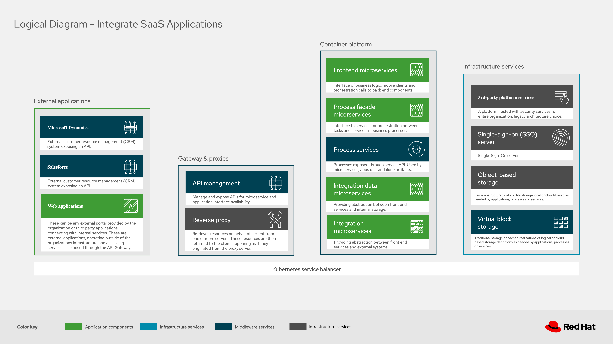

# Portfolio Architecture Examples

Example diagrams, pieces of diagrams, and examples for importing with URL feature of tooling. To use just import into tooling:

  **File -> Import from -> URL** 

(diagram tool hosted online for free usage here: https://redhatdemocentral.gitlab.io/portfolio-architecture-tooling)

Below you find the diagram project files (cut and paste URL into tooling to import) and images that can be used for slides (click to
enlarge an image):

## Logical diagrams

  - **Logical diagram (Cloud-native development):** 

     - https://gitlab.com/redhatdemocentral/portfolio-architecture-examples/raw/master/logical-diagram-cloud-native-development.drawio

  
  

  - **Logical diagram (Integrate SaaS applications):** 

     - https://gitlab.com/redhatdemocentral/portfolio-architecture-examples/raw/master/logical-diagram-integrate-saas-applications.drawio

  
  

  - **Logical diagram (Omnichannel customer experience):**

     -  https://gitlab.com/redhatdemocentral/portfolio-architecture-examples/raw/master/logical-diagram-omnichannel-customer-experience.drawio
  
  
  

  - **Logical diagram (from workshop):**

     - https://gitlab.com/redhatdemocentral/portfolio-architecture-examples/raw/master/example_logical_diagram.drawio

  

## Schematic diagrams
  
  - **Schematic diagram (Cloud-native development):**

     - https://gitlab.com/redhatdemocentral/portfolio-architecture-examples/raw/master/schematic-diagram-cloud-native-development.drawio
  
  
  
  
  
  
  

  - **Schematic diagram (Integrate SaaS applications):**

     - https://gitlab.com/redhatdemocentral/portfolio-architecture-examples/raw/master/schematic-diagrams-integrate-saas-applications.drawio
  
  
  
  
  

  - **Schematic diagram (Omnichannel customer experience):**

     - https://gitlab.com/redhatdemocentral/portfolio-architecture-examples/raw/master/schematic-diagrams-omnichannel-customer-experience.drawio

  
  
  
  
  
  

  - **Schematic diagram (from workshop):**

     - https://gitlab.com/redhatdemocentral/portfolio-architecture-examples/raw/master/example_schematic_diagram.drawio

## Detailed diagrams
  
  - **Detailed diagrams (Cloud-native development):**

     - https://gitlab.com/redhatdemocentral/portfolio-architecture-examples/raw/master/detailed-diagram-cloud-native-development.drawio
  
  
  
  
  
  
  
  

  - **Detailed diagrams (Integrate SaaS applications):**

     - https://gitlab.com/redhatdemocentral/portfolio-architecture-examples/raw/master/detailed-diagrams-integrate-saas-applications.drawio

  
  
  
  
  
  
  
  
  
  

  - **Detailed diagrams (Omnichannel customer experience):**

     - https://gitlab.com/redhatdemocentral/portfolio-architecture-examples/raw/master/detailed-diagrams-omnichannel-customer-experience.drawio

## Solution diagrams 

  - **IoT diagrams:**

     - https://gitlab.com/redhatdemocentral/portfolio-architecture-examples/raw/master/Asahi-OCP.drawio
  
  - **Red Hat on Red Hat diagrams:**

     - https://gitlab.com/redhatdemocentral/portfolio-architecture-examples/raw/master/RHonRH.drawio

## Community diagrams

  - **Camel-K event streaming hazard diagrams:**

     - https://gitlab.com/redhatdemocentral/portfolio-architecture-example/raw/master/community/Camel-K/Event-Streaming-Hazard.drawio 

  
