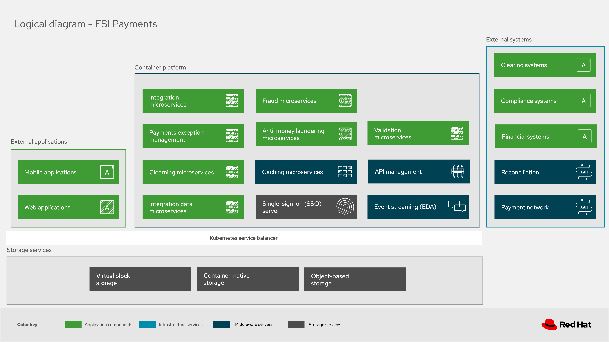
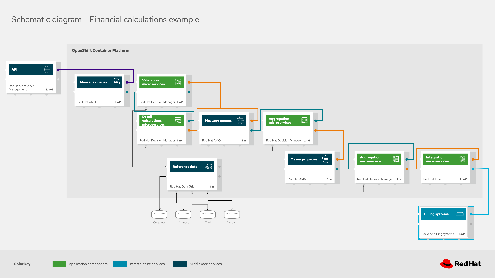
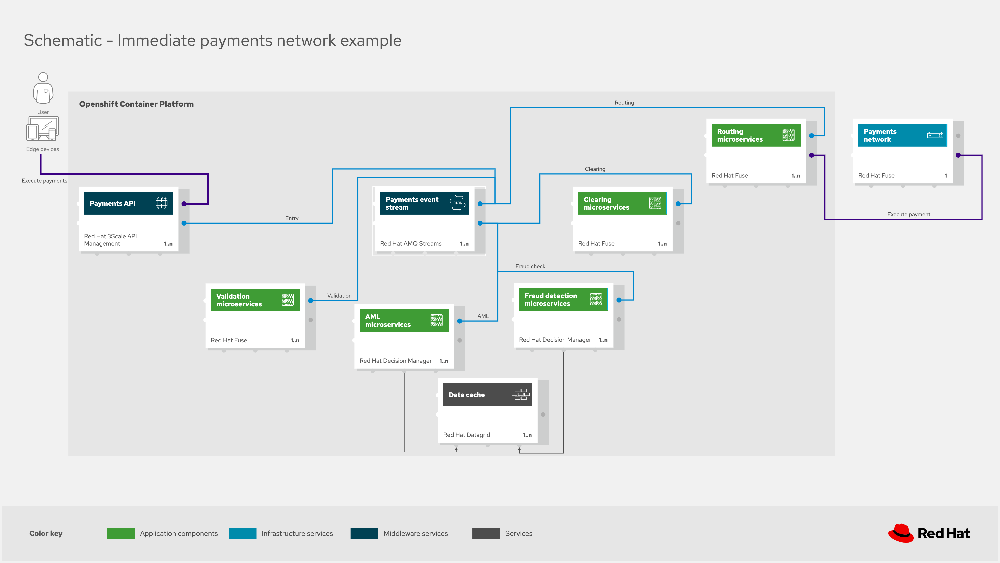
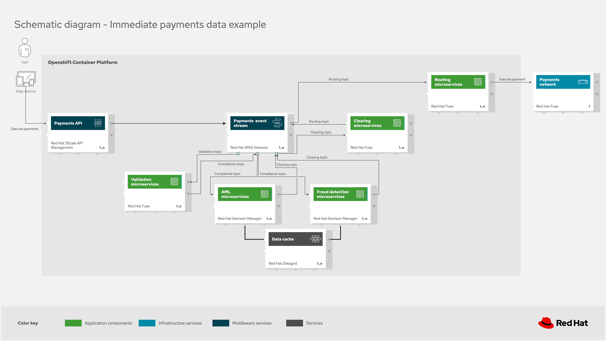
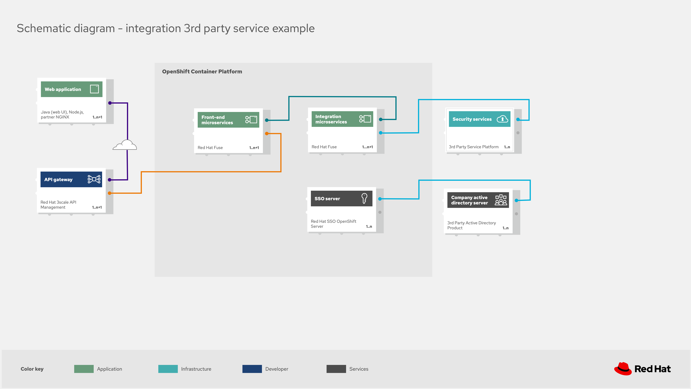
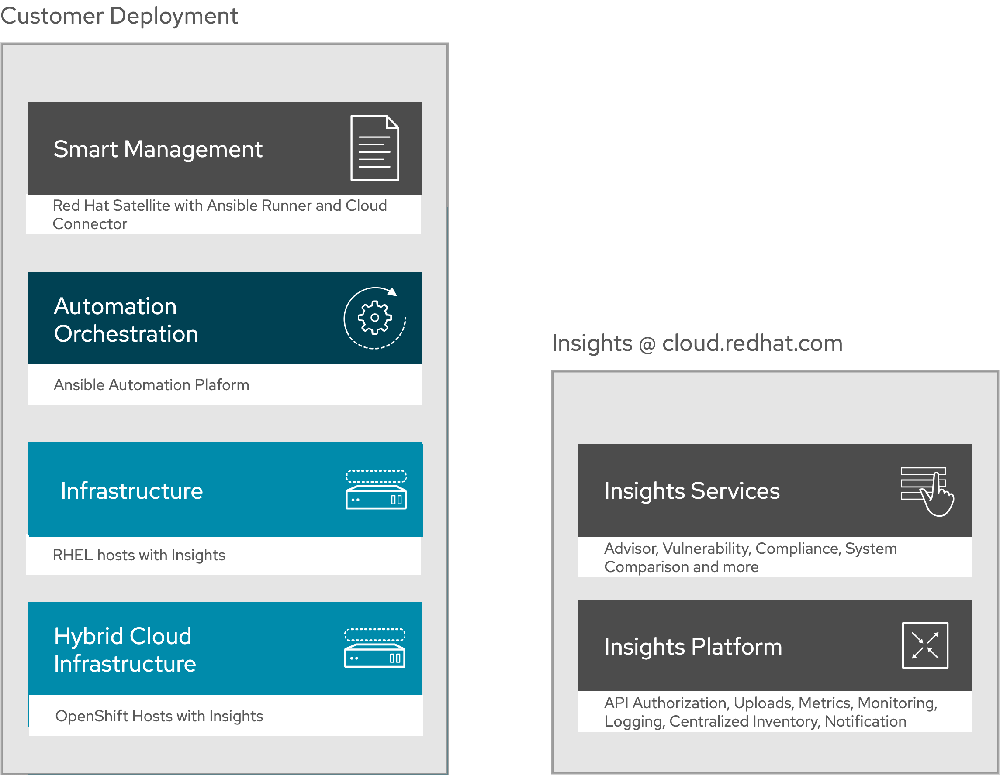
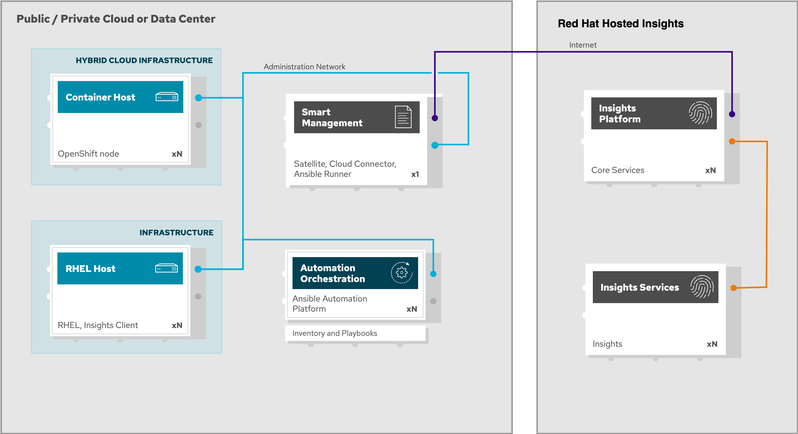
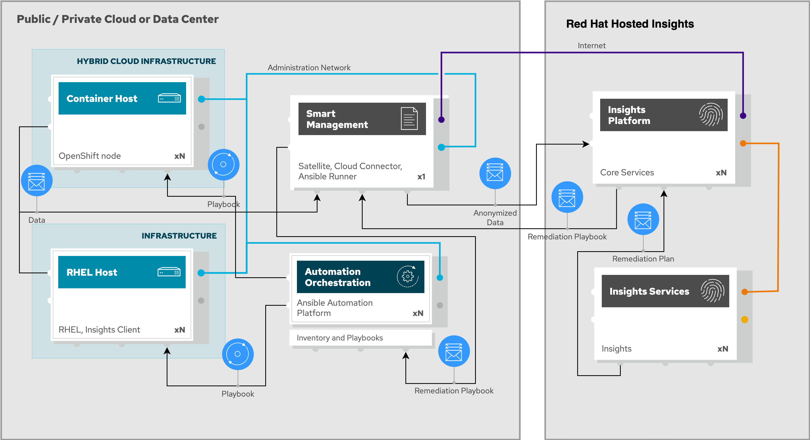
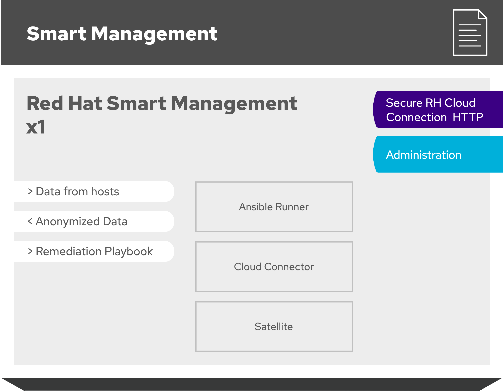
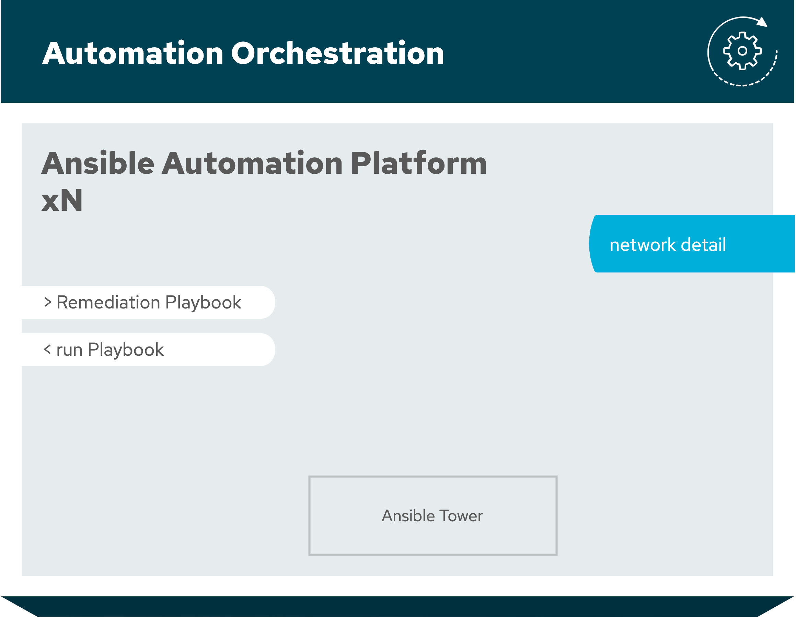

# Portfolio Architecture Examples

Diagram tool hosted online for free usage here: https://redhatdemocentral.gitlab.io/portfolio-architecture-tooling

You can download the example files and import them into the tool using:

  **File -> Import from -> Device** 

Or you can click on the "Load Diagram" link and load the drawing directly into the tool.

Images that can be used for slides (click to enlarge an image):

## Logical diagrams

### Logical Diagram (FSI payments):

[ [Load Diagram](https://redhatdemocentral.gitlab.io/portfolio-architecture-tooling/index.html?#/portfolio-architecture-examples/projects/logical-diagram-fsi-payments.drawio) ]  [  [Download Diagram](https://gitlab.com/redhatdemocentral/portfolio-architecture-examples/-/raw/master/diagrams/logical-diagram-fsi-payments.drawio?inline=false)  ]

### Logical diagram (Cloud-native development):
 
[ [Load Diagram](https://redhatdemocentral.gitlab.io/portfolio-architecture-tooling/index.html?#/portfolio-architecture-examples/projects/logical-diagram-cloud-native-development.drawio) ]  [  [Download Diagram](https://gitlab.com/redhatdemocentral/portfolio-architecture-examples/-/raw/master/diagrams/logical-diagram-cloud-native-development.drawio?inline=false)  ]

### Logical diagram (Integrate SaaS applications):

[ [Load Diagram](https://redhatdemocentral.gitlab.io/portfolio-architecture-tooling/index.html?#/portfolio-architecture-examples/projects/logical-diagram-integrate-saas-applications.drawio) ]  [ [Download Diagram](https://gitlab.com/redhatdemocentral/portfolio-architecture-examples/-/raw/master/diagrams/logical-diagram-integrate-saas-applications.drawio?inline=false) ]

### Logical diagram (Omnichannel customer experience)

[  [Load Diagram](https://redhatdemocentral.gitlab.io/portfolio-architecture-tooling/index.html?#/portfolio-architecture-examples/projects/logical-diagram-omnichannel-customer-experience.drawio) ]  [ [Download Diagram](https://gitlab.com/redhatdemocentral/portfolio-architecture-examples/-/raw/master/diagrams/logical-diagram-omnichannel-customer-experience.drawio?inline=false) ]

### Logical diagram (from workshop):

[ [Load Diagram](https://redhatdemocentral.gitlab.io/portfolio-architecture-tooling/index.html?#/portfolio-architecture-examples/projects/master/diagrams/example_logical_diagram.drawio) ]  [ [Download Diagram](https://gitlab.com/redhatdemocentral/portfolio-architecture-examples/-/raw/master/diagrams/example_logical_diagram.drawio?inline=false) ]

## Schematic diagrams

### Schematic diagram (FSI payments):

[ [Load Diagram](https://redhatdemocentral.gitlab.io/portfolio-architecture-tooling/index.html?#/portfolio-architecture-examples/projects/schematic-diagram-fsi-payments.drawio) ]  [  [Download Diagram](https://gitlab.com/redhatdemocentral/portfolio-architecture-examples/-/raw/master/diagrams/schematic-diagram-fsi-payments.drawio?inline=false)  ]

### Schematic diagram (Cloud-native development):

[ [Load Diagram](https://redhatdemocentral.gitlab.io/portfolio-architecture-tooling/index.html?#/portfolio-architecture-examples/projects/schematic-diagram-cloud-native-development.drawio) ]  [ [Download Diagram](https://gitlab.com/redhatdemocentral/portfolio-architecture-examples/-/raw/master/diagrams/schematic-diagram-cloud-native-development.drawio?inline=false) ]

### Schematic diagram (Integrate SaaS applications):

[ [Load Diagram](https://redhatdemocentral.gitlab.io/portfolio-architecture-tooling/index.html?#/portfolio-architecture-examples/projects/schematic-diagrams-integrate-saas-applications.drawio) ]  [ [Download Diagram](https://gitlab.com/redhatdemocentral/portfolio-architecture-examples/-/raw/master/diagrams/schematic-diagrams-integrate-saas-applications.drawio?inline=false) ]

### Schematic diagram (Omnichannel customer experience):

[ [Load Diagram](https://redhatdemocentral.gitlab.io/portfolio-architecture-tooling/index.html?#/portfolio-architecture-examples/projects/schematic-diagrams-omnichannel-customer-experience.drawio) ]  [[Download Diagram](https://gitlab.com/redhatdemocentral/portfolio-architecture-examples/-/raw/master/diagrams/schematic-diagrams-omnichannel-customer-experience.drawio?inline=false) ]

### Schematic diagram (from workshop):

[ [Load Diagram](https://redhatdemocentral.gitlab.io/portfolio-architecture-tooling/index.html?#/portfolio-architecture-examples/projects/example_schematic_diagram.drawio) ]  [ [Download Diagram](https://gitlab.com/redhatdemocentral/portfolio-architecture-examples/-/raw/master/diagrams/example_schematic_diagram.drawio?inline=false)

## Detailed diagrams
  
### Detailed diagrams (Cloud-native development):

[ [Load Diagram](https://redhatdemocentral.gitlab.io/portfolio-architecture-tooling/index.html?#/portfolio-architecture-examples/projects/detailed-diagram-cloud-native-development.drawio) ]  [ [Download Diagram](https://gitlab.com/redhatdemocentral/portfolio-architecture-examples/-/raw/master/diagrams/detailed-diagram-cloud-native-development.drawio?inline=false) ]

### Detailed diagrams (Integrate SaaS applications):

[ [Load Diagram](https://redhatdemocentral.gitlab.io/portfolio-architecture-tooling/index.html?#/portfolio-architecture-examples/projects/detailed-diagrams-integrate-saas-applications.drawio) ]  [ [Download Diagram](https://gitlab.com/redhatdemocentral/portfolio-architecture-examples/-/raw/master/diagrams/detailed-diagrams-integrate-saas-applications.drawio?inline=false) ]

### Detailed diagrams (Omnichannel customer experence):

[ [Load Diagram](https://redhatdemocentral.gitlab.io/portfolio-architecture-tooling/index.html?#/portfolio-architecture-examples/projects/detailed-diagrams-omnichannel-customer-experience.drawio) ]  [ [Download Diagram](https://gitlab.com/redhatdemocentral/portfolio-architecture-examples/-/raw/master/diagrams/detailed-diagrams-omnichannel-customer-experience.drawio?inline=false) ]

## Solution diagrams 

### IoT diagrams:

[ [Load Diagram](https://redhatdemocentral.gitlab.io/portfolio-architecture-tooling/index.html?#/portfolio-architecture-examples/projects/Asahi-OCP.drawio) ]  [ [Download Diagram](https://gitlab.com/redhatdemocentral/portfolio-architecture-examples/-/raw/master/diagrams/Asahi-OCP.drawio?inline=false) ]

### Red Hat on Red Hat diagrams:

[ [Load Diagram](https://redhatdemocentral.gitlab.io/portfolio-architecture-tooling/index.html?#/portfolio-architecture-examples/projects/RHonRH.drawio) ]  [ [Download Diagram](https://gitlab.com/redhatdemocentral/portfolio-architecture-examples/-/raw/master/diagrams/RHonRH.drawio?inline=false) ]

### Automated Infrastructure Remediation 

[ [Load Diagram](https://redhatdemocentral.gitlab.io/portfolio-architecture-tooling/index.html?#/portfolio-architecture-examples/projects/all_in_one_remediation.drawio) ]  [ [Download Diagram](https://gitlab.com/redhatdemocentral/portfolio-architecture-examples/-/raw/master/diagrams/all_in_one_remediation.drawio?inline=false) ]

## Community diagrams

### Camel-K event streaming hazard diagrams:

[ [Load Diagram](https://redhatdemocentral.gitlab.io/portfolio-architecture-tooling/index.html?#/portfolio-architecture-examples/projects/Event-Streaming-Hazard.drawio) ]  [ [Download Diagram](https://gitlab.com/redhatdemocentral/portfolio-architecture-examples/-/raw/master/diagrams/community/Event-Streaming-Hazard.drawio?inline=false) ]

