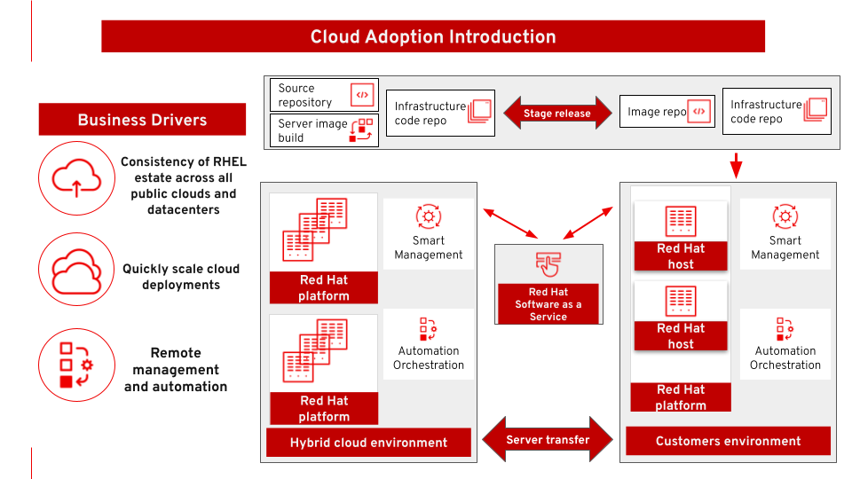

= Cloud adoption
Eric D. Schabell @eschabell, Iain Boyle @iainboy
:homepage: https://gitlab.com/redhatdemocentral/portfolio-architecture-examples
:imagesdir: images
:icons: font
:source-highlighter: prettify
:toc: left
:toclevels: 5

This architecture covers cloud adoption. As enterprises adopt to public and/or private clouds, it is important to
provide automation to manage and scale server deployments and to provide the capability to transition servers between
data centers and cloud providers. This provides flexibility and portability.

*Use case:* Accelerating cloud adoption with effective automation for deploying and managing workloads across multiple
cloud infrastructures according to performance, security, compliance, and cost requirements.

--

--

Open the diagrams below directly in the diagram tooling using 'Load Diagram' link. To download the project file for
these diagrams use the 'Download Diagram' link. The images below can be used to browse the available diagrams and can
be embedded into your content.

--
https://redhatdemocentral.gitlab.io/portfolio-architecture-tooling/index.html?#/portfolio-architecture-examples/projects/cloud-adoption.drawio[[Load Diagram]]
https://gitlab.com/redhatdemocentral/portfolio-architecture-examples/-/raw/main/diagrams/cloud-adoption.drawio?inline=false[[Download Diagram]]
--

== The technology
--
image:logical-diagrams/cloud-adoption-ld.png[350, 300]
--

* The following technology was chosen for this solution:

** *Red Hat OpenShift* is an enterprise-ready Kubernetes container platform built for an open hybrid cloud strategy.
It provides a consistent application platform to manage hybrid cloud, multicloud, and edge deployments.

** *Red Hat Ansible Automation Platform* is a foundation for building and operating automation across an organization.
The platform includes all the tools needed to implement enterprise-wide automation.

** *Red Hat Insights* continuously analyzes platforms and applications to predict risk, recommend actions, and track
costs so enterprises can better manage hybrid cloud environments.

** *Red Hat Smart Management* combines the flexible and powerful infrastructure management capabilities with the
ability to execute remediation plans. It helps you more securely manage any environment supported by Red Hat Enterprise
Linux, from physical machines to hybrid multiclouds.

** *Red Hat OpenShift Data Foundations* is software-defined storage for containers. Engineered as the data and storage
services platform for Red Hat OpenShift, Red Hat OpenShift Data Foundation helps teams develop and deploy applications
quickly and efficiently across clouds.

** *Red Hat Satellite* is an infrastructure management product specifically designed to keep Red Hat Enterprise Linux
environments and other Red Hat infrastructure running efficiently, with security, and compliant with various standards.

** *Red Hat Quay* is a private container registry that stores, builds, and deploys container images. It analyzes your
images for security vulnerabilities, identifying potential issues that can help you mitigate security risks.

** *Red Hat Enterprise Linux* is the world’s leading enterprise Linux platform. It’s an open source operating system
(OS). It’s the foundation from which you can scale existing apps—and roll out emerging technologies—across bare-metal,
virtual, container, and all types of cloud environments.

== Cloud adoption overview
--
image:schematic-diagrams/cloud-adoption-network-sd.png[350, 300]
image:schematic-diagrams/cloud-adoption-data-sd.png[350, 300]
--

* This is an overview look at cloud adoption, providing the solution details and the elements described above
in both a network and data centric view:

** The infrastructure starts with a deployment head, where the definitive software library is maintained through
development and connections to the Red Hat content delivery network. Ansible is used to maintain and deliver playbooks
based infrastructure automation delivery to as many detached deployment heads as needed. There is also centralised
montoring and logging within this deployment head.

** In our research the deployment head and detached deployment heads all ran on some form of virtualisation platforms.
They were also supported by network services like DNS and other security services.

** The detached deployment heads were used to then roll out and support the necessary cloud environments, using
OpenStack Director to maintain compute nodes and controllers for both compute and storage.

== Extra detail

These are the detailed diagrams for specific elements from the schematic diagrams above:

--
image:detail-diagrams/cloud-adoption-smart-management.png[250, 200]
image:detail-diagrams/cloud-adoption-automation.png[250, 200]
image:detail-diagrams/cloud-adoption-scm.png[250, 200]
image:detail-diagrams/cloud-adoption-image-store.png[250, 200]
--

