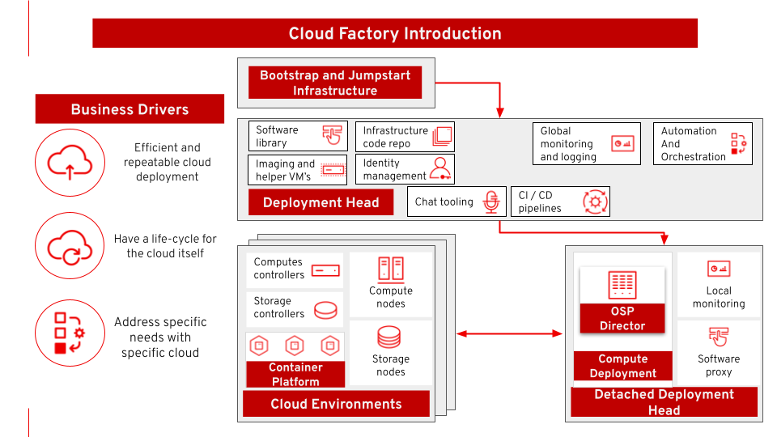

= Cloud factory
Eric Lavarde @L1
:homepage: https://gitlab.com/redhatdemocentral/portfolio-architecture-examples
:imagesdir: images
:icons: font
:source-highlighter: prettify
:toc: left
:toclevels: 5

Instead of buying a cloud, large enterprise wants cloud factory, being able to deploy and manage the cloud in a modern
and automated manner. This architecture covers deploying in an automated manner multiple instance of an OpenStack and
Ceph based cloud, following the principles of *Infrastructure as Code*.

*Use case:* Deploy multiple private clouds based on the same (infrastructure as) code using different parametrization
(Ansible inventories).

--

--

== The technology
--
image:logical-diagrams/cloud-factory-ld.png[750, 700]
--
* The following technology was chosen for this solution:

*Red Hat OpenStack Platform* essential part of the factory where it virtualize resources from hardware, organizes those
resources into clouds, and manages them.  So automation can be done on top of it allowing access hardware what they
need, when they need it.

*Red Hat Ceph Storage* Software-defined storage solution that is simple to setup, supports automation, and easy to
scale and manage. It's a good cloud factory choice because it's ability to store data as objects that can be easily
shared across a network.

*Red Hat Ansible Automation Platform* For building and operating automation as code. The platform act as the centralized
control to execute the code for deploymenet and remediation base on the anaylsis of collected environment data.

*Red Hat Satellite* Manages the infrastructure, provides versioning and management of trusted softwares for containers,
RPMs or libraries used in applications.

*Red Hat Enterprise Linux* Enterprise Linux platform. Host virtual, container, and all types of cloud environments.

*Red Hat Virtualisation* virtualization workloads built on Red Hat Enterprise Linux and KVM.

*Red Hat OpenShift* the Kubernetes container platform that provides a consistent application platform to manage hybrid
cloud, multicloud, and edge deployments.

*Red Hat Identity Management* for applying centralized and unified identity management authentication, policies, and
authorization policies to all cloud built.

== Cloud factory network overview
--
image:schematic-diagrams/cloud-factory-sd.png[750, 700]
--

* This example shows two cloud deployments. The first is the detached deployment head and the second is a cloud
environment.

** Detached Head Deployment

*** Compute Deployment - The Openstack Platform is used to enable further computer nodes in deployed cloud environments.

** Software Proxy - Pulls all the images from the deployment head and ensures that only trusted images are being rolled
out in the various cloud environments_ of choice.

** Cloud Environment

*** The focus is on the main elements found in the deployments, such as the OpenStack compute controllers managing the
compute nodes. A tenant of these nodes is shown as the OpenShift Container Platform providing a container-based
Platform-as-a-Service (PaaS).

== Cloud factory data overview
--
image:schematic-diagrams/cloud-factory-data-sd.png[750, 700]
--

* This is an overview look at cloud factory, providing the solution details and the elements described above in both a
network and data centric view:

** The infrastructure starts with a deployment head, where the definitive software library is maintained through
development and connections to the Red Hat content delivery network. Ansible is used to maintain and deliver playbooks
based infrastructure automation delivery to as many detached deployment heads as needed. There is also centralised
monitoring and logging within this deployment head.

** In our research the deployment head and detached deployment heads all ran on some form of virtualisation platforms.
They were also supported by network services like DNS and other security services.

** The detached deployment heads were used to then roll out and support the necessary cloud environments, using
OpenStack Director to maintain compute nodes and controllers for both compute and storage.

== Download diagrams
View and download all of the diagrams above in our open source tooling site.
--
https://redhatdemocentral.gitlab.io/portfolio-architecture-tooling/index.html?#/portfolio-architecture-examples/projects/cloud-factory.drawio[Open Diagrams]
--
