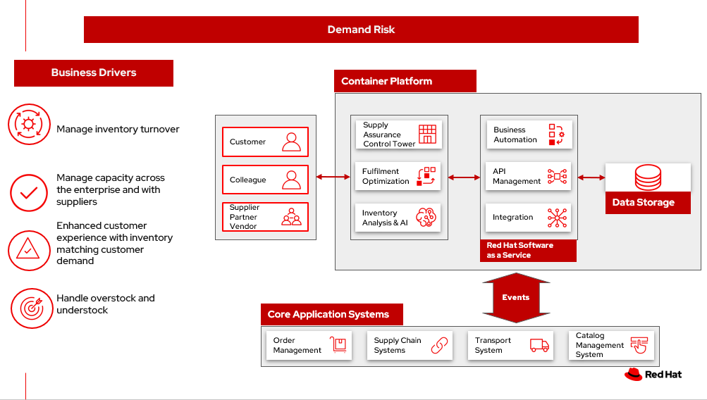
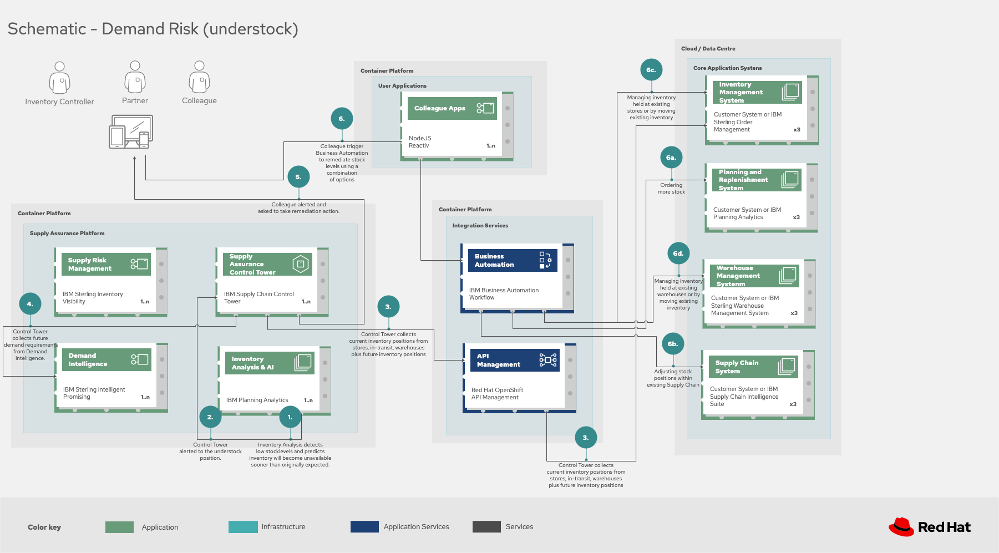
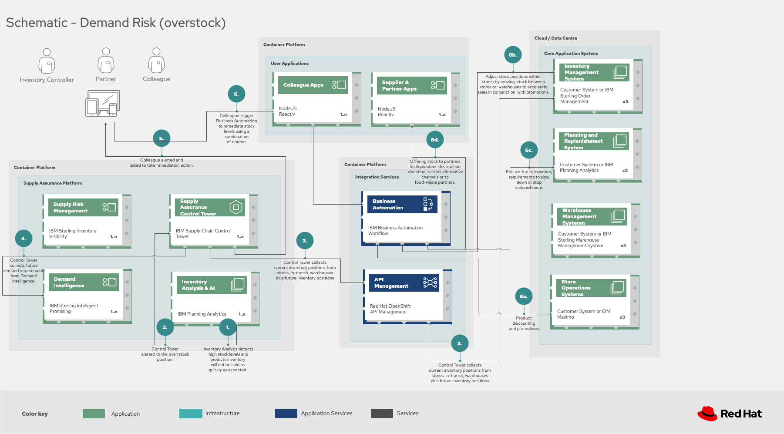

== Demand risk

To demonstrate the importance of inventory optimization for any
business, we will focus on one of the main demand risk use cases:
understock and overstock. We will start by defining the business problem
and the two main use cases: understock and overstock, describe the
challenges and business drivers organizations face. Next, we will
provide an action guide, provide an overview of the solution, show a
schematic of the two use cases, understock and overstock, and conclude
with the technology used in the solution.

For a comprehensive inventory solution overview, see
link:supplychain.md[Inventory Optimization].

=== Business problem

Inventory optimization is a critical element of any retail
organisation’s fulfilment process. It represents a balancing act between
two key viewpoints in the fulfilment process.

The first viewpoint is *demand*. The business needs to understand their
current demand for products, goods and services. There are two aspects
of demand, the ``current'' demand and the ``future'' demand. Current
demand asks the question, ``how many unsatisfied orders or requests do
we have in the system at this point in time?'' Future demand asks the
more difficult question, ``how many orders or requests do we expect to
have at some point in the future?'' This future point could be measured
in minutes, hours, days, weeks, months and even years. The further into
the future, the harder it becomes to predict the demand.

The second viewpoint is *inventory*. The business needs to have a clear
understanding of all the inventory held within their fulfilment system.
An inventory management provides oversight of current inventory and
inventory changes due to purchases. Performs analysis on sold products,
keeps consolidated stock data, and handles stock allocation. Makes
decision on reallocation of goods between multiple warehouses. Inventory
is stock or inventory available for sale to customers. As with demand,
inventory has two aspects, ``current'' and ``future'' inventory. Current
inventory asks two questions, ``how many items of a particular product
do I have available at this point in time?'' and ``where are those items
located?'' Future inventory asks the question, ``how much inventory is
required at some point in the future''. As with demand, this future
point could range from minutes to years and becomes increasingly harder
to predict the further into the future.

_Inventory optimization_ is making sure the current and future demand is
accurately balanced against current and future inventory. Getting the
balance correct leads to a successful and profitable retail business.
Getting the balance wrong leads to failure and in the worst case,
eventual collapse of the business.

To demonstrate the importance of inventory optimization for any retail
business, this document will focus on main use cases of demand and
inventory.

=== Use cases

Two main issues are represented by demand risk.

*Understock* refers to not holding sufficient inventory to meet current
demand. This includes not having enough inventory today but also, not
having enough inventory in the very near future that could be used to
meet the demand. The end result is disappointed customers who order but
don’t get fulfillment or can’t order due to lack of product. This
``stock out'' position often represents between 4-8% of total sales
lost, but can also be a failed opportunity to satisfy customer in other
ways, through up-sell and cross-sell. KPIs that can help avoid an under
stock or stock-out position. include inventory turn over rate, days on
hand and lead time (how long it takes to get more inventory from a
supplier).

*Overstock* refers to holding more stock than required to meet current
and future demand. This results in additional costs to store then
dispose of overstocked items via discounts, selling at a loss or
destruction. Whilst understock is measured in customer satisfaction and
loss of future opportunity, overstock has direct impact on the
bottom-line costs and profitability of the business. KPIS relevant to
overstock include, holding costs, dead stock (in-stock items failing to
sell) and inventory turnover rates.

=== Challenges / Business Drivers

*Challenges*

* Maintaining inventory control of high value items to minimize loss and
associated cost.
* When stores receive inventory from warehouse or direct from suppliers,
how to manage direct ship is a real challenge for each store as it has
to be managed at the store level.
* Forecasting inventory levels intelligently to meet customer demand.
* Efficiently handle overstocking and understocking events

*Drivers*

* Inventory turnover - if improve by 2 or 3 times then will drive bigger
profit
* Managing capacity - across the enterpriese and with suppliers
* Enhanced customer experience with inventory matching customer demnd
* Handling overstock and understock events

==== Responses

[width="100%",cols="50%,50%",options="header",]
|===
|Business Problem |Solution
|Unusual events, such as the global pandemic, war or other international
incident, port issues, and waterway obstructions illustrate the need for
enterprises to build resilient supply chains. |Respond with
intelligence, speed, and confidence to reduce the impact of disruptions,
turning these events into opportunities to outperform and outcompete.

|Manual processes, limited capabilities of inventory management tools,
and global operations pose a challenge for enterprises to manage and act
on inventory and mitigate disruptions to meet actual demand. |Monitor
and manage network inventory availability and respond to disruptions
such as out-of-stock and overstock with alerts and recommended actions.

|The lack of pertinent product information and poor data flow across
partners lead to inefficient inventory management, waste, and lost
sales. |Gain detailed visibility into inventory characteristics at each
location.
|===

=== Business outcomes

* Improve inventory demand and forecasting
* Automated processes updating inventory in closer to real time
* Efficient, consistent decision making of overstock and understock

=== Solution overview

This solution in the following diagram reflects steps in the Action
Guide:

* Create a world-class sensing and risk-monitoring operation.
* Accelerate automation in extended workflows
* Amp up AI to make workflows smarter
* Include sustainability commitments in decision making
* Modernize for modern infrastructures, scale hybrid cloud platforms

The solution uses the following technologies, which can be grouped into
three main categories as shown in the following diagram:

* Core application systems. Often customer-provided technologies, such
as order management, facilities management. These systems can be
stand-alone applications, on premises and cloud services, databases.
* Foundational infrastructure. The Red Hat/IBM solution is built on Red
Hat OpenShift. Data is routed through API management. Events are routed
through Business Automation tools such as Business Automation Workshop.
* Inventory Optimization platform

=== Understock

The following diagram shows the schematic for the understock use case.

Understock workflow steps:

Inventory Analysis detects low stock levels and predicts inventory will
become unavailable sooner than originally expected.

Inventory Control Tower alerted to the understock position.

Inventory Control Tower collects current inventory positions from
stores, in-transit, warehouses plus future inventory positions

Inventory Control Tower collects future demand requirements from Demand
Intelligence.

Colleague alerted and asked to take remediation action.

Colleague triggers Business Automation to remediate stock levels using a
combination of options, including:

Ordering more stock

Adjusting stock positions within existing Supply Chain

Managing inventory held at existing stores or by moving existing
inventory

Managing inventory held at existing warehouses or by moving existing
inventory

=== Overstock

The following diagram shows the schematic for the overstock use case.

Overstock workflow steps:

Inventory Analysis detects high stock levels and predicts inventory will
not be sold as quickly as expected.

Inventory Control Tower alerted to the overstock position.

Inventory Control Tower collects current inventory positions from
stores, in-transit, warehouses plus future inventory positions.

Inventory Control Tower collects future demand requirements from Demand
Intelligence.

Colleague alerted and asked to take remediation action.

Colleague triggers Business Automation to remediate stock levels using a
combination of options, including:

....
<ol type="a"><li>Product discounting and promotions.</li>
<li>Adjust stock positions within stores by moving stock between stores or warehouses to accelerate sales in conjunction with promotions.</li>
<li>Reduce future inventory requirements to slow down or stop replenishment.</li>
<li>Offering stock to partners for liquidation, destruction, donation, sale via alternative channels or to food-waste partners.</li>
</ol>
....

=== Technology

The following technology was chosen for this solution:

https://www.redhat.com/en/technologies/cloud-computing/openshift[_Red
Hat OpenShift_] Kubernetes offering, the hybrid platform offering allow
deployment across data centers, private and public clouds as it brings
choices and flexible for hosting system and services.

https://www.redhat.com/en/technologies/management/ansible[_Red Hat
Ansible Automation Platform_] operate, scale and delegate automate IT
services, track changes an update inventory, prevent configuration drift
and integrated with ITSM.

https://access.redhat.com/documentation/en-us/red_hat_openshift_api_management/1/guide/53dfb804-2038-4545-b917-2cb01a09ef98[_Red
Hat OpenShift API Management_] is a managed API traffic control and
program management service to secure, manage, and monitor APIs at every
stage of the development lifecycle.

https://www.redhat.com/en/getting-started-devops[_Red Hat OpenShift
DevOps_] represents an approach to culture, automation and platform
design intended to deliver increased business value and responsiveness
through rapid, high-quality service delivery. DevOps means linking
legacy apps with newer cloud-native apps and infrastructure. A DevOps
developer can link legacy apps with newer cloud-native apps and
infrastructure.

https://www.ibm.com/products/business-automation-workflow[_Business
Automation Workflow_] automate business processes, case work, task
automation with Robotic Process Automation (RPA) and Intelligent
Automation such as conversation intelligence.

https://www.ibm.com/products/supply-chain-intelligence-suite[_IBM Supply
Chain Control Tower_] provides actionable visibility to orchestrate your
end-to-end supply chain network, identify and understand the impact of
external events to predict disruptions, and take actions based on
recommendations to mitigate the upstream and downstream effects.

https://www.ibm.com/products/intelligent-promising[_IBM Sterling
Intelligent Promising_] provides shoppers with greater certainty, choice
and transparency across their buying journey. It includes:

* https://www.ibm.com/products/fulfillment-optimizer[_IBM Sterling
Fulfillment Optimizer with Watson_] to determine the best location from
which to fulfill an order, based on business rules, cost factors, and
current inventory levels and placement
* https://www.ibm.com/products/inventory-visibility[_Sterling Inventory
Visibility_] to processes inventory supply and demand activity to
provide accurate and real-time global visibility across selling
channels.

https://www.ibm.com/products/planning-analytics[_IBM Planning Analytics
with Watson_] streamlines and integrates financial and operational
planning across the enterprise.

https://www.ibm.com/products/envizi[_Envizi_] simplifies the capture,
consolidation, management, analysis and reporting of your environmental,
social and governance (ESG) data.

==== Supply Assurance Platform details

With Inventory Control Tower, you:

* *View*. End to end supply chain coverage
** Visibility across siloed data sources
** External data Track & trace
* *Detect*. Work – queues of prioritized issues
** KPIs based on business rules and alerts
** Analytics using AI and machine learning
* *Guide*. Determine best approach for the situation
** Defined best practice solutions
** Context and recommendations
* *Act*. Quick, efficient and uniform problem resolution
** Intelligent workflows with guidance
** Automation to back-end systems

Respond faster to changes, enable efficient collaboration and decision
support, and drive operational automation with Control Tower.

[width="100%",cols="25%,25%,25%,25%",options="header",]
|===
|Use Case |The Problem |The Solution |The Benefits and Implications
|Reduce out of stock (OOS) or approaching out of stock (AOOS)conditions
|Out of stock situations lead to lost revenue and decreased brand /
retailer loyalty. |SCIS Control Tower monitors inventory levels at all
locations in a client’s network and creates items in the work queue when
revenue is at risk. When drilling down on the item, users can see where
they have available inventory and receive recommendations about how much
inventory can and should be transferred to the OOS / AOOS locations.
|Action can be taken directly from the Control Tower user interface. OOS
situations are efficiently managed and AOOS are avoided with minimal
human intervention.

|Manage industrial and manufacturing critical supplies |Out of stock
situations lead to line outages, manufacturing delays, and lost revenue.
|SCIS Control Tower monitors inventory to requested demand and creates
items in the work queue when delivery is at risk. When drilling down on
the item, users can see parts by SKU and location to see which supply is
at risk take action to minimize impact. |Minimize production and parts
impact due to OOS / AOOS situations. Increase throughput and minimize
customer delays. Minimize expedited and remediation costs.
|===

Inventory is managed by exception. Manage and predict inventory
exceptions such as: low inventory, stockouts, slow moving and aging
inventory. Optimize inventory transfers to mitigate these circumstances.

=== Action Guide

From a high-level perspective, there are several main steps your
organization can take to drive innovation and move toward a digital
supply chain:

* Automation
* Sustainability
* Modernization

[width="100%",cols="34%,33%,33%",options="header",]
|===
| |Actionable Step |Implementation details
|Automation |Create a world-class sensing and risk-monitoring operation
|Integrate data from multiple systems to get enterprise-wide view of
changes in inventory demand. Monitor and analyze near real-time data

|Automation |Accelerate automation in extended workflows |As an example,
in the Reduce out of stock (OOS) or approaching out of stock (AOOS)
conditions, a SCIS Control Tower monitors inventory levels at all
locations in a client’s network and creates items in the work queue when
revenue is at risk.

|Automation |Amp up AI to make workflows smarter |When users are
inspecting inventory items by drilling down on the item, users see where
they have available inventory and receive recommendations about how much
inventory can and should be transferred to the OOS / AOOS locations.
These recommendations are based on adding automation and AI to make
workflows smarter.

|Sustainability |Include sustainability commitments in decision making
|Integrate sustainability metrics in overstock and understock decision
making.

|Modernization |Modernization for modern infrastructures, scale hybrid
cloud platforms |The decision for a future, Kubernetes-based enterprise
platform is defining the standards for development, deployment and
operations tools and processes for years to come and thus represents a
foundational decision point.
|===

=== Similar use cases

See:

* link:./perfectorder.md[Inventory management]
* link:lossmanagement.md[Loss and waste management]
* link:timeliness.md[Product timeliness]
* link:./intelligentorder.md[Intelligent order]
* link:./sustainablesupplychain.md[Sustainable supply chain]

For a comprehensive supply chain overview, see
link:supplychain.md[Supply Chain Optimization].

=== Downloads

View and download all of the *Inventory Optimization diagrams* shown in
previous sections in our open source tooling site.

* PowerPoint Solution Overview:
link:./downloads/SupplyChainOptimization.SolutionOverview.pptx[Open
Solution Overview]
* PowerPoint Reference Architecture:
link:./downloads/SupplyChainOptimization.ReferenceArchitecture.pptx[Open
Workflow Diagrams]
* DrawIO: [Open Schematic
Diagrams](./downloads/SupplyChainOptimization.drawio

=== Contributors

* Iain Boyle, Chief Architect, Red Hat
* Mike Lee, Principal AI Ops Technical Specialist, IBM
* James Stewart, Principle Account Technical Leader, IBM
* Bruce Kyle, Sr Solution Architect, IBM Client Engineering
* Mahesh Dodani, Principal Industry Engineer, IBM Technology
* Thalia Hooker, Senior Principal Specialist Solution Architect, Red Hat
* Jeric Saez, Senior Solution Architect, IBM
* Lee Carbonell, Senior Solution Architect & Master Inventor, IBM
