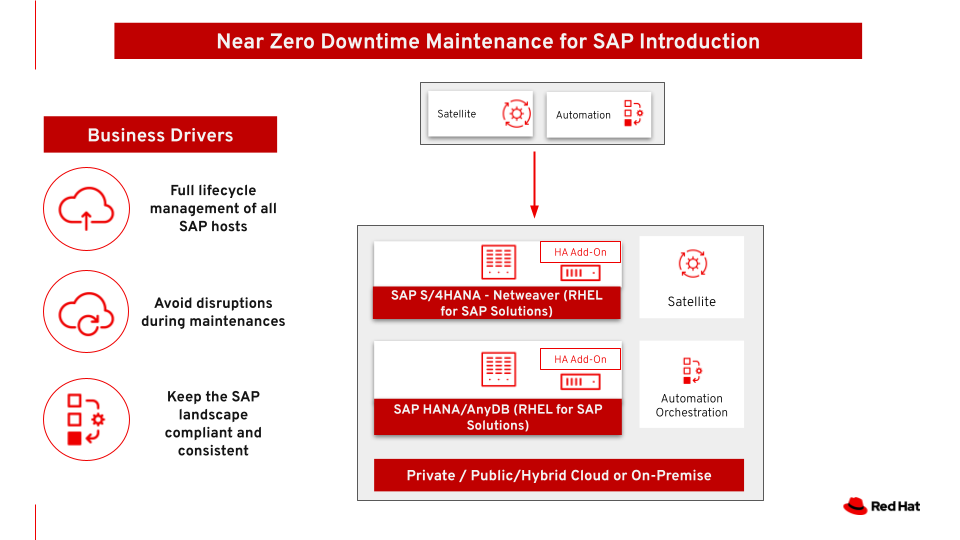

= Near Zero Downtime Maintenance for SAP
Ricardo Garcia Cavero @ipbabble
:homepage: https://gitlab.com/redhatdemocentral/portfolio-architecture-examples
:imagesdir: images
:icons: font
:source-highlighter: prettify

This architecture covers Near Zero Downtime Maintenance for RHEL servers hosting SAP workloads. SAP workloads are critical in the company and the maintenance windows are very strict, sometimes making it difficult for the system administrators to finish the update tasks properly in time. This solution allows for application of OS patches, fixes, updates, DB patches and new versions and SAP kernel updates while users can continue to work inside SAP, not perceiving any disruption

Use case: Minimizing the downtime of the maintenances on SAP hosts so that users and processes can continue to work without perceiving any interruption

Open the diagrams below directly in the diagram tooling using 'Load Diagram' link. To download the project file for these diagrams use
the 'Download Diagram' link. The images below can be used to browse the available diagrams and can be embedded into your content.

--
https://redhatdemocentral.gitlab.io/portfolio-architecture-tooling/index.html?#/portfolio-architecture-examples/projects/nzd-sap.drawio[[Load Diagram]]
https://gitlab.com/redhatdemocentral/portfolio-architecture-examples/-/raw/main/diagrams/nzd-sap.drawio?inline=false[[Download Diagram]]
--

--

--

--
image:logical-diagrams/nzd-sap.png[350, 300]
image:schematic-diagrams/nzd-sap-network-sd.png[350, 300]
image:schematic-diagrams/nzd-sap-data-sd.png[350, 300]
--

--
image:detail-diagrams/satellite.png[250, 200]
image:detail-diagrams/ansible-automation-platform.png[250, 200]
image:detail-diagrams/ha-add-on.png[250, 200]
image:detail-diagrams/sap-hana-detail.png[250, 200]
image:detail-diagrams/sap-s4hana-detail.png[250, 200]
image:detail-diagrams/sap-netweaver-detail.png[250, 200]
--

