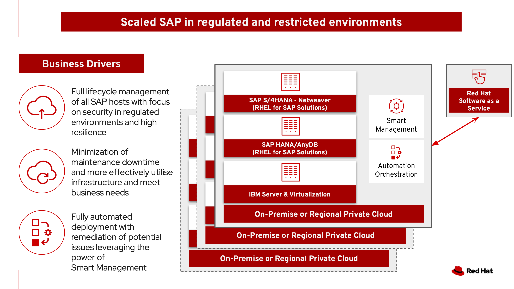
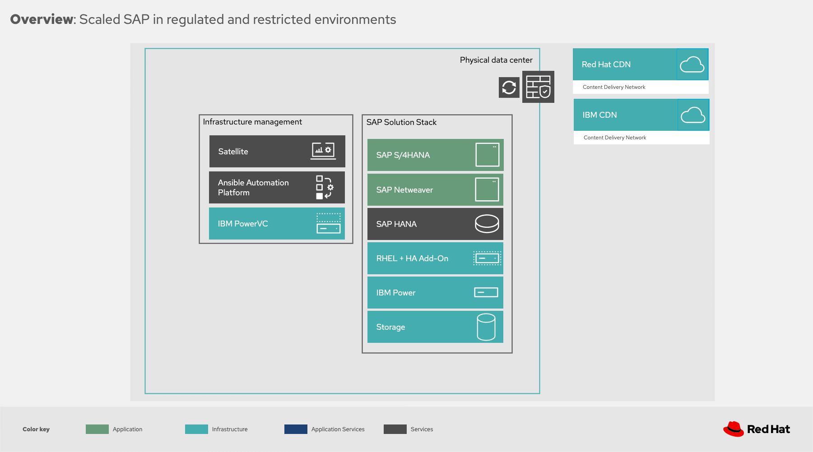

= Scaled SAP in regulated and restricted environments
Marc Schindler @mschindl, Fabio Alessandro Locati @fale, Enrico Guarino @eguarino
:homepage: https://gitlab.com/osspa/portfolio-architecture-examples
:imagesdir: images
:icons: font
:source-highlighter: prettify
:toc: left
:toclevels: 5

_Some details will differ based on the requirements of a specific implementation but all portfolio architectures generalize one or more successful deployments of a use case._

*Use case:* Modernize regulated and restricted SAP environments with high scaleable IBM Power server in a fully automated way for the complete life cycle, which includes day2 operations and reduces infrastructure and personal costs.

*Background:*
SAP customers need to migrate to the new suite SAP S/4HANA[1] by 2027. That is a very complex process during which all the customer custom code must be reviewed and if still useful, taken out of the SAP backend so that further upgrade processes are simplified and accelerated. The requirements of regulated and restricted environments must also be considered and complied with.

Regardless of the above migration plan on the part of SAP, *Red Hat Virtualization* customers with SAP or other workloads have to migrate to an alternative hypervisor/solution by August 31, 2024[2].

[1] S/4HANA is short for SAP Business Suite 4 HANA. As the fourth version of the SAP Business Suite, it is the latest offering from SAP.  It runs only on the HANA database, which is an in-memory database developed and tuned by SAP for faster performance and real-time reporting.

[2] Maintenance support ends: https://access.redhat.com/support/policy/updates/rhev

== Solution overview 
The purpose of this solution is to completely automate the deployment of SAP HANA DB and SAP Application components based on IBM PowerVC, RHEL and pacemaker as high availability solution in a regulated and restricted environment.

This architecture covers generic information on the design of the infrastructure in a solution pattern:

.IBM Power
.IBM PowerVC
.Red Hat Enterprise Linux with Smart Management for SAP
.Red Hat Satellite
.Red Hat Ansible Automation Platform manages the life cycle of the RHEL servers.
.Red Hat Insights
All products are described in the technology capture below.

--

--

_Figure 1. Overall structure of the solution._

The following view shows which business drivers are to be covered by the solution. In addition, "Scaled SAP in regulated and restricted environments" is a solution that can be reproduced and is used by various customers. It is based on decades of experience with state-of-the-art technology.

*Why should the customer use IBM Power servers?*

* On-premise Cloud Architecture
* Highly efficient and secure virtualisation
* Optimal maintenance concept  through Live Partition Mobility
* Effective use of resources  leads to energy savings

== Technology

The following hardware and technology was chosen for this solution:

====

https://www.ibm.com/power[*IBM Power Server*]
IBM Power is known for its scalability and performance with the most demanding workloads, its superior virtualization and management features for flexibility, its security with better isolation and integrated stack, and its leading availability for 13 years running.

https://www.ibm.com/de-de/products/powervc[*IBM PowerVC Virtualization*]
IBM PowerVC provides simplified virtualisation management and cloud deployments. IBM PowerVC is based on OpenStack. It provides simplified virtualisation management and cloud deployments for IBM AIX , IBM i and Linux virtual machines (VMs) running on IBM Power® Systems.

Example of SAP on PowerVC Deployment:
https://mediacenter.ibm.com/media/SAP+HANA+for+IBM+Power+Systems+-+PowerVC+Deployment/1_ohwmudpk[*SAP HANA Deployment on IBM Power and PowerVC*]

https://www.redhat.com/en/technologies/linux-platforms/enterprise-linux?intcmp=7013a00000318EWAAY[*Red Hat Enterprise Linux for SAP Solutions*]
RHEL for SAP is combining an intelligent operating system with predictive management tools and SAP-specific content. Red Hat Enterprise Linux for SAP Solutions provides a single, consistent, highly available foundation for business-critical SAP and non-SAP workloads.
Smart Management for SAP helps about the life cycle management of all SAP hosts with proactive detection and automatic remediation of potential issues.

https://www.redhat.com/en/technologies/management/insights?intcmp=7013a00000318EWAAY[*Red Hat Insights*] receives the anonymized data of the SAP hosts from Smart Management and makes it available to Red Hat Insights services the customer is subscribed to. It is a rule-based SaaS and it has dedicated rules for SAP hosts that are based on SAP's and Red Hat's recommendations and it detects and alerts when a host is not compliant with all these
recommendations.

https://www.redhat.com/en/technologies/management/smart-management?intcmp=7013a00000318EWAAY[*Red Hat Smart Management*] includes Satellite and Cloud Connector, provides the capability to gather anonymized configuration information from the SAP hosts and send that anonymized data to Insights Platform (on Red
Hat’s SaaS). Satellite manages the lifecycle of the SAP servers, applying the packages, security fixes, etc., that
they need to comply with SAP’s and Red Hat’s recommendations and consistent between them.

https://www.redhat.com/en/technologies/management/ansible?intcmp=7013a00000318EWAAY[*Red Hat Ansible Automation Platform*]
Red Hat Ansible Automation Platform is used for the automated life cycle of solution for all components, which leads to increased efficiency and stability in production. It is the framework used in this solution to run the remediation Ansible playbooks in the hosts that will correct the situations that could lead to a failure or issue. For example, modifying
a kernel memory parameter that can cause a bad performance of the SAP HANA DB or applying a certain level of an OS package that is needed for a particular version of SAP Netweaver.

====

== Architectures

=== Logical overview

Figure 2 provides a diagram of the architecture showing the major components and where they logically reside.

--

--

_Figure 2. Logical diagram of the architecture._

The logical overview shows that all components function smoothly in a disconnected or air-agapped environment and can be operated according to the highest safety standards.
Red Hat's and IBM's CDN was included because the packages have to be downloaded and deployed in their own data centre. Access to other websites is not required after the initial deployment.

=== Schematic overview
--

--

_Figure 3. Schematic diagram of the architecture._

The schematic overview explains the communication ways between all components and products. One of the importants part is the infrastructure management part, where Ansible Automation Platform, Smart management and the local repository is located.
If content from the public network / internet for the life cycle propose is needed then the communication goes through the proxy and firewall to the permitted CDNs.
All the data is located on one or several storages which provides for example NFS as file storage service and is also need by SAP as shared directory between the SAP instances. [3]

[3] https://www.sap.com/documents/2020/01/6e88b483-807d-0010-87a3-c30de2ffd8ff.html[*SAP HANA - Storage alternatives for HANA scale-out without Host Auto-Failover*]

== Deployment process

The requirements of enterprise customers show that a high level of automation with standardised approaches, such as platform as code, is necessary to ensure availability with the highest possible SLAs. Especially in critical infrastructures, it must be guaranteed and auditable.
With this solution we provide a lot of day 1 and day 2 taks which helps to achive the goals.

Explanation from Day0 to Day2:

.*Day0*

* Hardware will be placed at the right place in the data centre
+ Each components will be cabled
* Network switches and inital configuration
+ RHEL and PowerVC will be deployed fully automated with Red Hat Ansible > infrastructure as code

.*Day1*

* Activation of SAP HANA system replication (or equivalent high-availability feature of other DBs)
* High-availability Red Hat Enterprise Linux Pacemaker cluster build on both application and DB tiers
* Red Hat Insights agent activation
* Migration of SAP workloads from Suse Linux Enterprise Server to Red Hat Enterprise Linux

.*Day2*

* SAP instance system copies
* Spin up/delete new application servers on demand (namely for hyperscalers or service provider)
* Instance refreshes
* Kernel parameter changes
* SAP kernel upgrade
* DB operations
* DB and OS patching
* Resource addition (CPU, memory, disk)
* Cluster management
* DB backup/restore
* Stop/start of SAP instances
* Shutting down of sandbox/pre-production systems to cold storage and pulling them out of storage when needed
* Smart management and proactive issue resolution for SAP servers
* Near-zero downtime maintenance for SAP servers

===

There are official supportet Ansible collections and playbooks for the complete automation.

https://console.redhat.com/ansible/automation-hub/repo/published/redhat/sap_install/content/[[Automation Hub - Red Hat - SAP RHEL]]
https://console.redhat.com/ansible/automation-hub/repo/published/sap/sap_operations/content/[[Automation Hub - Partner - SAP Day2]]

https://github.com/sap-linuxlab/demo.sap_install/tree/powervc-v1[[IBM PowerVC - SAP Day2]]

This repository contains the demo for deploying on IBM PowerVC with ansible the community.sap_install collection and how to use this from Red Hat Ansible Controller (or AWX).
Additional support can be request at IBM.

== Download diagrams
View and download all of the diagrams above in our open source tooling site.
--
https://www.redhat.com/architect/portfolio/tool/index.html?#gitlab.com/osspa/portfolio-architecture-examples/-/raw/main/diagrams/sap-on-ibm-power.drawio[[Open Diagrams]]
--

== Provide feedback 
You can offer to help correct or enhance this architecture by filing an https://gitlab.com/osspa/portfolio-architecture-examples/-/blob/main/sap-smart-management.adoc[issue or submitting a merge request against this Portfolio Architecture product in our GitLab repositories].

