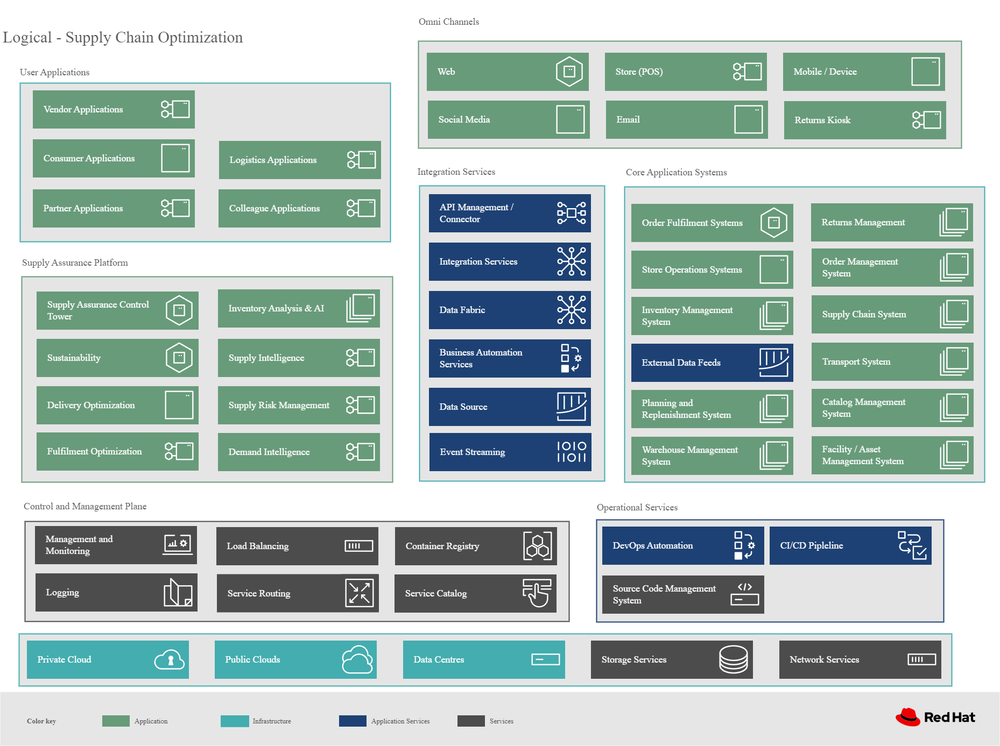

= Supply Chain Optimization Portfolio Architecture
:homepage: https://gitlab.com/osspa/portfolio-architecture-examples/
:imagesdir: images
:icons: font
:source-highlighter: prettify
:toc: left
:toclevels: 5

== Use Cases

This portfolio architecture addresses several main use cases for transforming supply chain risk factors:

* Perfect order (coming soon)
* Intelligent order (coming soon)
* Demand risk (coming soon)
* Loss and waste management (coming soon)
* Product timeliness  (coming soon)
* Sustainable supply  (coming soon)

These risk factors are described in more detail below:

==== Perfect order

Inventory may not be on hand or maybe in a different location than expected.
Multiple and partial shipments may be able to solve many customer
requests.

The business can respond to the imperfect order and increase customer
responsiveness with:

* Intelligent promising
* Optimization of user expectations with improved demand forecasting
* Automated responses

For more information and solution details on this scenario, see
Perfect order (coming soon)

==== Intelligent order

If the *last mile delivery* promise is incorrect and a product arrives
late (perhaps because of incorrect tracking information), is damaged or is never delivered there’s a good chance that the customer will shop with a
competitor next time.

For more information about the solution details in this scenario, see
Intelligent order (coming soon)

==== Demand risk

_Understock_ - not holding sufficient inventory to meet current demand.
This includes not having enough inventory today but also, not having
enough inventory in the very near future that could be used to meet the
demand.

_Overstock_ - holding more stock than required to meet current and
future demand. This results in additional costs to store and carry on the books, then possibly disposing of
overstocked items at a discount or even destroying them.

For more information about the solution details in this scenario, see
Demand risk (coming soon)

==== Loss and waste management

*Loss and waste management* requires you to take decisive action in
cases of:

* _Shelf life_. Identify and replace items in a timely way as shelf life expires.
* _Environmental exceptions_. Food expirations, power interruptions or
other disasters affecting the product salability.
* _Contamination or recall_. Quickly identify, and remove contaminated and
recalled items from sale or items that have a contaminated component.
Proactively provide safe alternatives or replacements when safe.

For more information about the solution details in this scenario, see
Loss and waste management (coming soon)

==== Product timeliness

*Product timeliness* is having goods and products in the right place at
the right time, packed correctly, and in line with customer expectations.
This risk is particular to seasonal goods, fast fashion, drugs,
cosmetics, grocery, and the food supply industries. KPIs relevant to product
timeliness include dead stock and inventory days on hand.

* _Shelf life_ defines a set of actions to be taken with products that
expire on specific dates and must be removed from use or sale. For
example, food can expire and need to be removed from shelves.
* _Timeliness_ defines a set of actions that can be taken when products
expire, but that may still have some benefit. For example,
the seasonality of clothing can be warehoused until the following year.

For more information about the solution details on this scenario, see
Product timeliness (coming soon)

==== Sustainable supply chain

*Sustainability* provides an opportunity to differentiate your business.
Yet the business must balance the long-term imperative to protect the
planet with the immediate need to preserve the bottom line. On a rapidly
warming planet, companies across sectors have transformed business
models to forge a sustainable future ‐ one that protects people, the planet,
and profits. In the race to reduce emissions, consumption, and waste,
everything is on the table. Supply chains are being recalibrated. Source
materials are evolving. Travel requests are carefully scrutinized.

For more information about the solution details on this scenario, see
Sustainable supply chain (coming soon)

== Background 

Retailers, manufacturers, and organizations are exploring ways to better
understand and act on changes in the market as they occur to
balance protecting margins, utilizing store and warehouse capacity, and
meeting delivery expectations. These sourcing decisions can dramatically
increase profits, especially during peak periods.

In addition, organizations are exploring how to provide a more
sustainable footprint. They are looking to redefine an
enterprise-wide approach to sustainability.

Given the complexity of supply chains, we start by discussing supply chain concepts, the business problem, and business
value and then provide actionable automation and
modernization steps organizations can take to drive
innovation and move toward a more optimized supply chain. These are based on
The Action Guide in Own your transformation survey of 1500 CSCOs across
24 industries. Actionable steps will be developed through the lens of
use cases on how the main risk factors can be transformed.

=== Supply chain concepts

_Fulfillment_ is the process of exceeding customer expectations when the
customer receives their requested products, goods, or services. The items
must be made available in a suitable timeframe, at the correct location,
and in an acceptable condition.

Fulfillment optimization takes the fulfillment process a step further by
using information and knowledge about the supply chain, inventory, and
stock positions to ensure any promises made to the customer are met or
exceeded.

A key element of the retail fulfillment process is knowing the inventory
position. This is the amount of stock available for sale to a customer,
its location, and the time it takes to make it available to the
customer.

_Inventory optimization_ is a collection of best practices for ensuring
the retail organization maintains complete and accurate stock levels
while balancing customer demand against current and future stock
levels.

_Sustainability_ in business refers to a company’s strategy to reduce
negative environmental impact resulting from its operations in a
particular market. An organization’s sustainability practices are
typically analyzed against environmental, social, and governance (ESG)
metrics.

The business goal is to balance the long-term imperative to protect the
the planet with the immediate need to preserve the bottom line.

=== Business problem

Chief Supply Chain Officers (CSCOs) face issues related to supply chain
disruptions, technology infrastructure, sustainability, and market
shifts as their greatest challenges. Yet when addressed with an open
mindset, challenges create opportunities within the enterprise.

Harvard Business Review article,
https://hbr.org/2022/11/3-steps-to-prepare-your-supply-chain-for-the-next-crisis[Three
steps to prepare your supply chain for the next crisis]. reports:

____
Companies that are well-prepared and as a result prosper in a crisis can
expect to recover more quickly than their competitors. In a review of
corporate performance during the past four U.S. downturns (since 1985),
Boston Consulting Group (BCG) found that 14% of companies
increased their sales and their profit margin.

Investors are starting to reward companies that build for the future by
becoming more innovative and more resilient. In June 2020, during the
depths of the Covid-19 pandemic, BCG surveyed major institutional
investors and found that nine out of ten believed it was ``important for
healthy companies to prioritize the building of business capabilities —
even if it means lowering earnings-per-share guidance or delivering
below consensus.''
____

The McKinsey report
https://www.mckinsey.com/capabilities/operations/our-insights/how-covid-19-is-reshaping-supply-chains[How
COVID-19 is reshaping supply chains] explains that companies found it
was easier to increase inventories than implement their preferred
strategy of nearshoring or regionalization. In addition, ``The proactive
monitoring of supplier risks was the primary focus …, yet significant
blind spots remain in most companies’ supply-chain risk-management
setups. Just under half of the companies in our survey say they
understand the location of their tier-one suppliers and the key risks
those suppliers face.''

Enhanced customer experiences, improved profitability, and more
predictive forecasts are high on CSCOs’ priority lists according to a
report by IBM Institute for Business Value,
https://www.ibm.com/downloads/cas/1BYY6VEM[Own your transformation:
Data-led innovation for the modern supply chain].

=== Business value

Inventory optimization is making sure the current and future demand is
accurately balanced against current and future inventory across the
enterprise. Getting the balance correct leads to a successful and
profitable retail business. Getting the balance wrong leads to failure
and, in the worst case, the eventual collapse of the business.

Specifically,
https://hbr.org/2022/11/3-steps-to-prepare-your-supply-chain-for-the-next-crisis?autocomplete=true[Harvard
Business Review article] recommends:

____
CEOs need to invest in risk intelligence and strategic foresight,
creating a team of procurement super-forecasters equipped with the
latest artificial-intelligence (AI)-powered sensing technology.
____

=== Impacts on KPIs

According to the https://www.ibm.com/downloads/cas/1BYY6VEM[IBM IBV
study], innovators track well ahead of their peers when it comes to
AI-enabled workflows for risk management and handling other
predictions. And they expect continued development of these workflows
and other capabilities over the next three years. Right now, Innovator
CSCOs report developing digitized workflows and leveraging AI automation
a full 95% more than their peers.

Innovators also stand out by leveraging data with AI and advanced
analytics in demand management. With demand volatility and associated
supplier, operations, and logistics disruption at all-time highs, CSCOs
are applying AI and machine learning to the critical and strategic
continuous planning elements of demand management and forecasting. A
full 90% of Innovators use AI and advanced analytics in demand
management and predictive forecasting, 18% more than their peers (76%).

Directly influence the following KPIs:

* Improve lost sales from stock out 4-8%
* Solution cost savings of 10%
* Increase stock turnover
* Reduce days on hand
* Manage lead time (maybe leading indicator of stock overage)
* Reduce holding cost
* Manage product risk/perishability/age
* Improve gross margin return on investment
* Reduce return rate
* Manage unusual events regarding weather, natural
disaster, supply chain interruption.
* Improve customer satisfaction

== Solution overview

This solution:

* Creates a world-class sensing and risk-monitoring operation.
* Accelerates automation in extended workflows
* Uses AI to make workflows smarter
* Modernizes infrastructure including scalable hybrid cloud platforms

Figure 1 provides a high-level overview of how systems work
together for the desired outcomes.

image::./images/intro-marketectures/supplychain-marketing-slide.png[solution overview]
_Figure 1. Supply chain optimization overview showing systems, users, and business drivers._

== Logical diagrams

Figure 2 shows the major systems and how they relate to each other. Figure 3 emphasizes the solution tiers and personas. The contents of these figures is discussed in greater detail in the following sections.

_Figure 2. Major systems and their relationships._

_Figure 3. The personas and technologies that provide a platform for some of the biggest potential breakthroughs in the supply chain._

== The Technology

Specifically, the recommended platform includes:

* https://developers.redhat.com/products/rhel/overview?intcmp=7013a00000318EWAAY[*Red Hat
Enterprise Linux*] is the world’s leading enterprise Linux platform.
It’s an open-source operating system (OS). It’s the foundation from
which you can scale existing apps—and roll out emerging
technologies—across bare-metal, virtual, container, and all types of
cloud environments.
* https://www.redhat.com/en/technologies/cloud-computing/openshift?intcmp=7013a00000318EWAAY)[*Red
Hat OpenShift*] is an enterprise-ready Kubernetes container platform
built for an open hybrid cloud strategy. It provides a consistent
application platform to manage hybrid cloud, including edge
deployments. Red Hat OpenShift supplies tools needed for DevOps, an approach to culture, automation, and platform
design intended to deliver increased business value and responsiveness
through rapid, high-quality service delivery.
* https://www.redhat.com/en/resources/integration-cloud-native-connectivity-datasheet?intcmp=7013a00000318EWAAY)[*Red Hat Integration*] Red Hat Integration provides developers and architects with cloud-native tools for integrating applications and systems. It offers capabilities for application and application programming interface (API) connectivity, API management and security, data transformation, service composition, service orchestration, real-time messaging, data streaming, change data capture, and cross-datacenter consistency to connect applications and data across hybrid cloud infrastructures.
* https://www.ibm.com/products/business-automation-workflow?intcmp=7013a00000318EWAAY[*Business
Automation Workflow*] (IBM) unites information, processes, and users to help
you automate digital workflows on-premises or on the cloud. Create workflows
that increase productivity, improve collaboration between teams, and
gain new insight to resolve cases and drive better business outcomes.
* https://www.redhat.com/en/technologies/management/ansible?intcmp=7013a00000318EWAAY[*Red Hat
Ansible Automation Platform*] Red Hat Ansible Automation Platform provides an enterprise framework for building and operating IT automation at scale across hybrid clouds including edge deployments. It enables users across an organization to create, share, and manage automation—from development and operations to security and network teams.
* https://access.redhat.com/documentation/en-us/red_hat_openshift_api_management/1/guide/53dfb804-2038-4545-b917-2cb01a09ef98?intcmp=7013a00000318EWAAY[*Red
Hat OpenShift API Management*] is a managed API traffic control and
program management service to secure, manage, and monitor APIs at every
stage of the development lifecycle.

=== The technology capabilities

The
solution architecture provides for:

* Independently deployable, scaled business services
* Composable, stateless modular services
* API first approach to building any service
* Inter-communication between services asynchronously
* Business functions and API access controls managed independently
* Can be deployed across multiple data centers for high availability capable of tenant-level failover

==== Foundational technologies ‐ Hybrid Cloud Platform

The decision to adopt a future-looking, Kubernetes-based enterprise platform is
defining the standards for development, deployment, and operations tools
and processes for years to come and thus represents a foundational
decision point. Key client value areas include:

* Platform for digital Transformation and modernization
* Accelerated application development for faster go-to-market and
innovation
* Engineering excellence through an enterprise open source
container platform
* Self-service transformation with DevOps/SRE and automated operations

== Architecture

The technologies in this architecture can be grouped into a variety of categories and sub-categories:

* *User applications*. Applications where supply chain activities are
reported and used by customers, colleagues, suppliers, and logistics. In
particular, the inventory controller interacts with the Inventory
Optimization Platform, described in the following section.
* *Core application systems*. 
The core application systems can be in-house applications, cloud
services, or third-party applications. The core applications provide
data through foundational technologies (such as API management that
provides monitoring and security). They can also respond to automated
actions based on business rules or from other layers in the system.
These include services, data, and systems currently used within the organization, such as:
** Point of Sale systems
** Store operations systems
** External data feeds
** Planning and replenishment system
** Warehouse management
** Order management
** Supply chain system
** Transport system
** Catalog management system
** Facility asset management system
* *Integration Services*. Manages the events and data between systems,
and includes:
** Integration services
** Data fabric
** Business automation
** DevOps
** API Management
* *Supply Assurance platform* including systems supporting:
** Supply assurance control tower
** Fulfillment optimization
** Inventory analysis and AI
** Supply intelligence
** Supply risk management
** Demand intelligence
** Sustainability
* *Omni Channels*
** Web applications for users
** Point of sale applications in stores
** Mobility and device applications
** Social media
** Email
** Partner applications

==== Supply Assurance Platform detail

Each of the core application systems provides data and responds to
events through these foundational technologies.

*Supply assurance control tower*. Gartner describes
https://www.gartner.com/smarterwithgartner/gartner-predicts-the-future-of-supply-chain-technology[supply
chain technology] as a central hub as an integrated part of a broader
SCM platform using these building blocks: people, process, data,
organization, and technology. The idea is to capture and use data to
provide enhanced real-time visibility and in-depth analysis.
https://www.ibm.com/products/supply-chain-intelligence-suite[IBM Supply
Chain Control Tower], powered by industry-leading AI, provides
actionable visibility to orchestrate your end-to-end supply chain
network, identify and understand the impact of external events to
predict disruptions, and take actions based on recommendations to
mitigate the upstream and downstream effects.

*Fulfillment optimization*. Gartner describes the
https://www.gartner.com/en/doc/fulfillment-forecasting-key-to-optimizing-retail-inventory-poisitioning[fulfillment
forecasting approach], which provides a more accurate view of consumer
fulfillment choices. This approach enables retailers to accurately gauge
the right amount of inventory required to meet demand in stores,
distribution centers, and other inventory holding notes throughout the
retailer’s network. IBM offers
https://www.ibm.com/products/intelligent-promising[IBM Sterling
Intelligent Promising] which provides shoppers with greater certainty, choice,
and transparency across their buying journey.

*Inventory analysis and AI*. This cognitive analytic engine enhances
existing order management systems. It determines the best location from
which to fulfill an order, based on business rules, cost factors, and
current inventory levels and placement. IBM includes
https://www.ibm.com/products/fulfillment-optimizer[IBM Sterling
Fulfillment Optimizer with Watson] as a component of IBM Sterling
Intelligent Promising.

*Supply risk management*. Gartner says the key tenets of supply
chain risk management enhances resilience and improve competitiveness.

* Market disruptions include: natural disasters, pandemics, political
uncertainty, economic upheaval, cyber and terrorist attacks, third-party
or supplier threats, and rapid swings in consumer preferences and
demand.
* Supply chain transformation also complicates supply chain risk
management ‐ lean, but complex and globally dispersed operations add
risks and the supply chain risk management process is vital to wringing
out inefficiencies and costs.

*Inventory visibility*. This processes inventory supply and demand
activity to provide accurate and real-time global visibility across
selling channels. For this solution, IBM offers
https://www.ibm.com/products/inventory-visibility[Sterling Inventory
Visibility], which is included with IBM Sterling Intelligent Promising.

*Planning and analytics*. Businesses need to evolve their planning and
analysis strategies to include continuous, integrated planning. This
means creating a single source of truth to streamline planning, manage
performance and build alignment across the enterprise. In this category
IBM offers:

* https://www.ibm.com/products/planning-analytics[IBM Planning Analytics
with Watson] to streamline and integrate financial and operational
planning across the enterprise.
* https://www.ibm.com/products/mro-inventory-optimization[IBM Maximo MRO
Inventory Optimization] to help you optimize your maintenance, repair
and operations (MRO) inventory by providing an accurate, detailed
picture of performance.

*Sustainability*. To put your sustainability goals into action, you need
a strategy and solutions that are specific to your needs. Businesses can
approach sustainability initiatives by:

* Strategic partnership with Red Hat and IBM.
* Using environmental, social, and governance (ESG) reporting to
integrate data silos. Find new opportunities to drive positive change
across your operations with https://www.ibm.com/products/envizi[Envisi].
* To manage assets, you can create a lower-emissions business. Use
automation to track resource usage, reduce costs and improve services
with https://www.ibm.com/products/maximo[IBM Maximo Application Suite].

=== Action guide

From a high-level perspective, several main steps are suggested for your
organization to drive innovation and move toward a digital supply chain.

==== Automation

* Accelerate automation in extended workflows
* Use AI to make workflows smarter
* Cultivate collaborative ecosystems

==== Sustainability

* Link environmental and social initiatives with business solutions
* Optimize workflows with AI to manage carbon, waste, energy, and water
consumption
* Compete with new sustainable products and services

==== Modernization

* Architect modern infrastructures
* Scale hybrid cloud platforms
* Increase awareness of cybersecurity vulnerabilities and solutions

For specific steps on this approach, see *The Action Guide* details in
https://www.ibm.com/downloads/cas/1BYY6VEM[Own your transformation]
survey of 1500 CSCOs across 24 industries.

=== Personas

The following personas within the organization may be stakeholders for one or more aspects of this architecture.

* *Executive sponsors*. Global Supply Chain VP/Officer, VP Global Supply
Chain Operations, IT Innovation, eComm Inventory Controller, Merchandise
Logistics Manager, Store Operations VP/Lead
* *Influencers*. Inventory control specialists, Inventory management
director, Supply chain professional, Store inventory manager,
Fulfillment manager, Inventory analyst, Financial control
officer/controller, Demand forecaster analyst, Inventory planner
* *Operations*. Warehouse managers, Logistics managers

The following represent users of the system outside of the organization.

* *Customers*
* *Business partners*
* *Vendors*

=== Next steps

See _Action Guide_ section in each of the use cases:

* Perfect order (coming soon)
* Intelligent order (coming soon)
* Demand risk (coming soon)
* Loss and waste management (coming soon)
* Product timeliness  (coming soon)
* Sustainable supply  (coming soon)

== Contributors

* Iain Boyle, Chief Architect, Red Hat
* Mike Lee, Principal AI Ops Technical Specialist, IBM
* James Stewart, Principle Account Technical Leader, IBM
* Bruce Kyle, Sr Solution Architect, IBM Client Engineering
* Mahesh Dodani, Principal Industry Engineer, IBM Technology
* Thalia Hooker, Senior Principal Specialist Solution Architect, Red Hat
* Rajeev Shrivastava, Account Technical Lead, IBM
* Ashok Iyengar, Executive Cloud Architect, IBM
* Karl Cama, Chief Architect, Red Hat
* Jeric Saez, Senior Solution Architect, IBM
* Lee Carbonell, Senior Solution Architect & Master Inventor, IBM
* Ramesh Yerramsetti, Customer Success Architect, IBM

== Downloads

View and download all of the *Inventory Optimization diagrams* shown in
previous sections in our open source tooling site.

* PowerPoint Solution Overview:
link:./downloads/SupplyChainOptimization.SolutionOverview.pptx[Open
Solution Overview]
* PowerPoint Reference Architecture:
link:./downloads/SupplyChainOptimization.ReferenceArchitecture.pptx[Open
Workflow Diagrams]
* DrawIO: link:./downloads/SupplyChainOptimization.drawio[Open Schematic
Diagrams]

== Provide feedback
You can offer to help correct or enhance this architecture by filing an https://gitlab.com/osspa/portfolio-architecture-examples/-/blob/main/supplychain.adoc[issue or submitting a merge request against this Portfolio Architecture product in our GitLab repositories].

