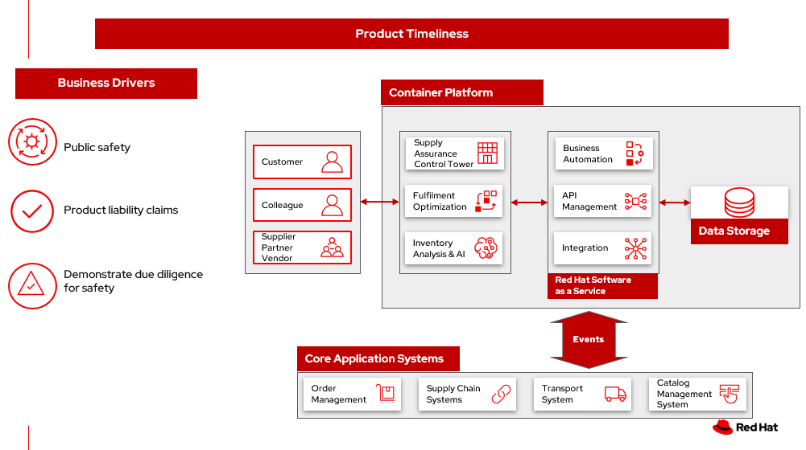
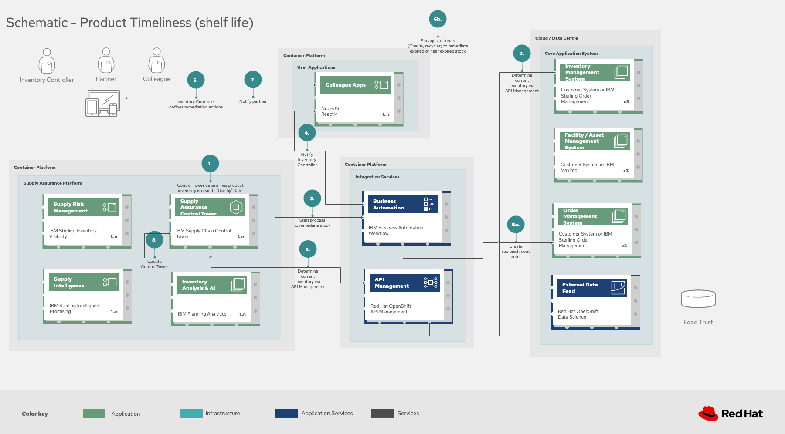

= Product Timeliness
:homepage: https://gitlab.com/osspa/portfolio-architecture-examples/
:imagesdir: images
:icons: font
:source-highlighter: prettify
:toc: left
:toclevels: 5

== Use cases

Products held in inventory often decrease in value over time and can even become worthless. This portfolio architecture addresses two primary use cases of product timeliness:

Responding to _Shelf life_ defines a set of actions to be taken with
products that expire on specific dates and should generally no longer be sold. Some products, such as drugs, must be removed from sale as a matter of law in the US.

_Relevance_ defines a set of actions that can be taken when products
are no longer relevant, possibly due to seasonality, but that may be
still have some value. For example, seasonal gardening and landscaping products can be
warehoused until the following year or, alternatively, sold off at a discount.

== Background 

Product timeliness refers to goods and products being in the right place at the right time, not out-of-date, and in line with customer expectations. 

Perishable food items are perhaps the canonical example of products that have a limited shelf life. Even if they’re not labeled with a specific “sell by” or “use by” date, that wilted head of lettuce is probably not going to be a popular consumer choice. Furthermore, stock your produce department with fruits and vegetables that are routinely past their prime and many consumers will simply stop shopping at your store at all. (Common practices and labels according to the USDA and FDA are explained in https://www.canr.msu.edu/news/expiring-products-food-ingredients[Expiring
Products – Food & Ingredients] by Michigan State University.)

But many food products carry some sort of “use by” or “best by” labeling. Even though, with some exceptions like infant formula, these dates don’t mean the store can’t still sell the product anyway, many consumers will pass on the old stock.

Even outside of food and drugs, other product categories quickly lose value as well. Fast fashion, electronics, toys, and many other product categories go out of style or are replaced with new models—meaning they can’t be sold at sticker price if at all. Even boring seasonal products that don’t change much like snow shovels still tie up money that could be better used while they sit in a warehouse all summer.

Key performance indicators (KPIs) relevant to product timeliness include dead stock and inventory days on hand. 

Fundamentally, in the best case, unsold goods are “just” consuming working capital and shelf or warehouse space. A retailer may decide it’s a reasonable tradeoff to hold over a seasonable product for the next selling season although they may instead decide to hold an end of season sale or negotiate a transfer to a third-party. Whatever they decide to do, the result is lower profits than if they had been able to sell just enough product at the appropriate time.

In other cases, a store may need to offer deep discounts on an expiring item, if indeed they can sell it at all. Everyone has surely seen “Manager’s Special” labels on meat and other items that are getting close to their “sell by” date. Consumers may even appreciate the discounting stores do to manage excess inventory. But those watching over the finances at the company are probably less impressed. (In some cases, such as books historically, the manufacturer or publisher carried most of the excess inventory risk. But it’s usually borne by the retailer.)

In still other cases, the product may simply not be able to be sold at all whether for safety, liability, or reputational concerns—or because of rules set by regulators.

A key part of reducing inventory-related financial impact is identifying and managing stock that’s either about to expire or is otherwise becoming less relevant to your customer base.

==== Responses

Many goods offered in retail and supplier businesses expire, although there are many other aspects of inventory to manage as well, including relevance which we also discuss here.

[width="100%",cols="50%,50%",options="header",]
|===
|Business problem |Solution
|Manual processes, limited capabilities of inventory management tools,
and global operations pose a challenge for enterprises to manage and act
on inventory. |Monitor
and manage network inventory availability and anticipate actions due to
expiration of products with alerts and recommended actions.

|The lack of pertinent product information (remaining shelf life,
ambient temperature, etc.) and poor data flow across partners lead to
inefficient inventory management, wastage and lost sales. |Gain detailed
visibility into inventory characteristics at each location – e.g., by
remaining shelf life, time-since-harvested. Maintain freshness by acting
on alerts received when items are at risk.

|Visibility into actions needed and alternatives to anticipate and
respond to inventory as items approach end of shelf life. |Provide
actionable tasks, work orders, visibility for workers and supply chain
partners to remove end of life items. Proactively replace items in
response to product timeliness.
|===

== Solution overview

The product timeliness solution shown below uses components that can be grouped into three main categories as shown in Figure 1:

The solution uses the following technologies, which can be grouped into
three main categories as shown in Figure 1:

* *Core application systems.* These are often customer-provided technologies, such as order management and facilities management. These systems can include standalone applications, on-premises and cloud services, and databases.
* *Foundational infrastructure.* The Red Hat/IBM solution is built on Red Hat OpenShift with data routed through API management and events routed through business automation tools such as Business Automation Workshop.* 
* *Inventory Optimization platform.* This consists of a Supply Assurance Control Panel, Fulfillment Optimization, and Inventory Analysis and AI.

_Figure 1._ Overall view of the product timeliness solution.

== Summary video

== Logical diagram

--
image:https://gitlab.com/osspa/portfolio-architecture-examples/-/raw/main/images/logical-diagrams/inventoryoptimisation-ld.png[alt="Logical view", width=700]
--

_Figure 2. The personas and technologies that provide a platform for some of the biggest potential breakthroughs in the supply chain._

== Technology

The following technology was chosen for this solution:

https://www.redhat.com/en/technologies/cloud-computing/openshift?intcmp=7013a00000318EWAAY[*Red
Hat OpenShift*] is an enterprise-ready Kubernetes container platform built for an open hybrid cloud strategy. It provides a consistent application platform to manage hybrid cloud, including edge deployments. Red Hat OpenShift supplies tools needed for DevOps, an approach to culture, automation, and platform design intended to deliver increased business value and responsiveness through rapid, high-quality service delivery.

https://www.redhat.com/en/technologies/management/ansible?intcmp=7013a00000318EWAAY[*Red Hat
Ansible Automation Platform*] provides an enterprise framework for building and operating IT automation at scale across hybrid clouds including edge deployments. It enables users across an organization to create, share, and manage automation—from development and operations to security and network teams.

https://access.redhat.com/documentation/en-us/red_hat_openshift_api_management/1/guide/53dfb804-2038-4545-b917-2cb01a09ef98?intcmp=7013a00000318EWAAY[*Red
Hat OpenShift API Management*] is a managed API traffic control and
program management service to secure, manage, and monitor APIs at every
stage of the development lifecycle.

https://www.ibm.com/products/business-automation-workflow[*Business
Automation Workflow*] automates business processes, case work, task
automation with Robotic Process Automation (RPA) and Intelligent
Automation such as conversation intelligence.

https://www.ibm.com/products/supply-chain-intelligence-suite[*IBM Supply
Chain Control Tower*] provides actionable visibility to orchestrate your
end-to-end supply chain network, identify and understand the impact of
external events to predict disruptions, and take actions based on
recommendations to mitigate the upstream and downstream effects.

https://www.ibm.com/products/intelligent-promising[*IBM Sterling
Intelligent Promising*] provides shoppers with greater certainty, choice
and transparency across their buying journey. It includes:

* https://www.ibm.com/products/fulfillment-optimizer[*IBM Sterling
Fulfillment Optimizer with Watson*] to determine the best location from
which to fulfill an order, based on business rules, cost factors, and
current inventory levels and placement
* https://www.ibm.com/products/inventory-visibility[*Sterling Inventory
Visibility*] to processes inventory supply and demand activity to
provide accurate and real-time global visibility across selling
channels.

https://www.ibm.com/products/planning-analytics[*IBM Planning Analytics
with Watson*] streamlines and integrates financial and operational
planning across the enterprise.

== Architecture

=== Solution Principles

*True end-to-end visibility*. Remove data silos and create a unified
view across supply chain data with a standard data platform.
Personalized dashboards and insights provide a 360-degreee view of KPIs
and significant events.

*Manage by exception*. Detect, display, and prioritize work tasks in
real time. This allows companies to sense and react to issues quickly
while managing risks and disruptions in a supply chain proactively.

*Intelligent workflows*. Actionable workflows can be customized to meet
unique requirements and process steps required to automate actions
within source transactional systems. Make informed decisions with a
supply chain virtual assistant that provides responses to issues based
on a company’s supply chain data using natural language search.

=== Shelf life

Figure 3 shows the schematic for the shelf life use case which relates to the set of actions to be taken with
products that expire on specific dates and must generally be removed from use or
sale.

_Figure 3. Schematic diagram for shelf life use case._

Shelf life steps:

[arabic]
. Inventory Control Tower hueristics determine product inventory is
near its ``Use by'' date
. Inspects current inventory
. Notifies the Inventory Controller to take action
. Creates replenishment order
. Engages partners (such as a charity or a recycler) to remediate expired or near
expired stock

=== Relevance

Figure 4 shows the schematic for the relevance use case which relates to a set of actions that can be taken when products
are no longer relevant, possibly due to seasonality, but that may be
still have some value.

_Figure 4. Schematic diagram for relevance use case._

The steps for relevance are somewhat more complex than for shelf life:

[arabic]
. Demand Intelligence determines requirements for seasonal goods, products with particular types of demand trends, and time-sensitive future inventory

. Demand Intelligence informs Control Tower of future inventory to meet
seasonal and product trends

. Inventory Control Tower collects Inventory (3a) and Supply Chain Intelligence (3b)
information to understand current position and ability to meet future
demand

. Inventory Control Tower determines if current and future Inventory does not match
inventory timeliness requirements for the business and automates changes to
Inventory via Fulfillment Optimiztion

. For any non-automated changes, it alerts Colleague (the humans in the loop) to take remediation
action

. Colleague runs ``what-if'' analysis in Inventory Control Tower to determine the best
course of actions using Inventory and Demand data

. Colleague triggers Business Automation to remediate stock levels using a
combination of options, including:

* Adjusting product orders

* Managing inventory held at existing stores or by moving existing
inventory

* Selecting alternative products

== Action Guide

From a high-level perspective, there are several main steps your
organization can take to drive innovation and move toward a digital
supply chain:

* Automation
* Sustainability
* Modernization

[width="100%",cols="34%,33%,33%",options="header",]
|===
| |Actionable Step |Implementation details
|Automation |Create a world-class sensing and risk-monitoring operation
|Integrate data from multiple systems to get an enterprise-wide view of
changes in inventory demand. Monitor and analyze near real-time data.

|Automation |Accelerate automation in extended workflows |Provide
actionable tasks, work orders, and visibility for workers and supply chain
partners to remove end of life items. Proactively replace items in
response to product timeliness.

|Automation |Amp up AI to make workflows smarter |For expiring products,
Control Tower monitors inventory levels at all locations in a company’s
network and creates items in the work queue when revenue is at risk.
When drilling down on an item, users can see where they have available
inventory and receive recommendations about how much inventory can and
should be ordered for replacement based on demand.

|Sustainability |Include sustainability commitments in decision-making
|Decision-making includes sustainability in handing items being removed
from stock.

|Modernization |Modernization for cloud-native infrastructures, including scalable hybrid
cloud platforms |The decision for a future, Kubernetes-based enterprise
platform is defining the standards for development, deployment, and
operations tools and processes for years to come and thus represents a
foundational decision point.
|===

== Similar use cases

See:

* https://www.redhat.com/architect/portfolio/detail/37[Demand risk]

* https://www.redhat.com/architect/portfolio/detail/41[Loss and waste management]

* Perfect order (coming soon)

* Intelligent order (coming soon)

* Sustainable supply  (coming soon)

For a comprehensive supply chain overview, see
https://www.redhat.com/architect/portfolio/detail/36[Supply Chain Optimization].

== Contributors

* Iain Boyle, Chief Architect, Red Hat
* Mike Lee, Principal AI Ops Technical Specialist, IBM
* James Stewart, Principle Account Technical Leader, IBM
* Bruce Kyle, Sr Solution Architect, IBM Client Engineering
* Mahesh Dodani, Principal Industry Engineer, IBM Technology
* Thalia Hooker, Senior Principal Specialist Solution Architect. Red Hat
* Jeric Saez, Senior Solution Architect, IBM
* Lee Carbonell, Senior Solution Architect & Master Inventor, IBM

== Download diagrams
View and download all of the diagrams above on our open source tooling site.
--
https://www.redhat.com/architect/portfolio/tool/index.html?#gitlab.com/osspa/portfolio-architecture-examples/-/raw/main/diagrams/supplychain.drawio[[Open Diagrams]]
--

== Provide feedback
You can offer to help correct or enhance this architecture by filing an https://gitlab.com/osspa/portfolio-architecture-examples/-/blob/main/timeliness.adoc[issue or submitting a merge request against this Portfolio Architecture product in our GitLab repositories].

