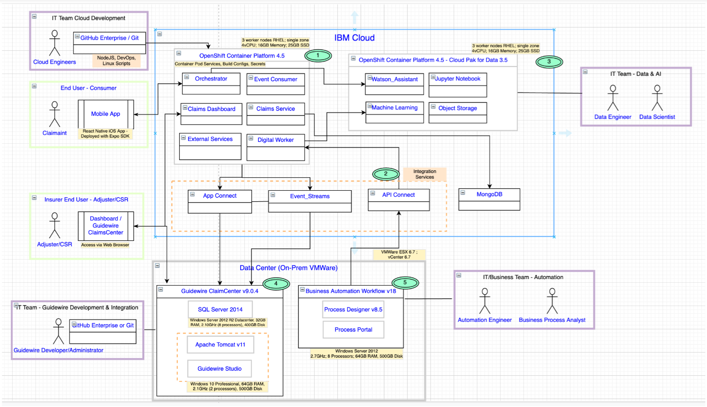

= Intelligent Automation Workflow for Claims

Synergy/collaboration work between Red Hat FSI Product Marketing and IBM Insurance CTO.

The Intelligent Automation for Claims use case automates existing manual processes, tasks and workflows when dealing with automotive vehicle related claim losses. The benefits of this automation includes improved operational efficiency and consistency of claim reviews, reduced skills required by claims processing adjusters or Customer Service Representatives, automated fraud risk detection for reduction of processing costs, and a heightened customer engagement experience. It provides a running instance of an implementation along with key platform capabilities such as cloud pak for data, core system integration services, cloud native applications and automation workflows that support business processes. A logical architecture view of this solution can be found here.

=== Products in use: 

Red Hat OpenShift, IBM Cloud Pak for Data, IBM Financial Services Workbench, IBM API Connect (API Management), AMQ Streams, MongoDB, Guidewire (ISV insurance core), Business Automation Workflow.

* Architecture Diagram:

=== Description:

1. Cloud native services (Orchestrator, Event Consumer, Digital Worker, etc.) running on OpenShift Container Platform that perform business critical logic and tasks essential for the intelligent workflow functions. These components can cater to several application end points including customer mobile applications, core systems, business automation workflows and external systems/APIs.

2. Integration Services provide a two-way interface into core insurer systems(Guidewire Claim Center in this use case) and enable end-points for on-premise applications(business processes) to interact with the business functions in the digital worker.

3. Data & AI capabilities provided by Cloud Pak for Data provide insight services via Machine learning services, Jupyter notebooks, Watson services and Object storage for data repositories. The insights are made available by the digital workers and help the business automation flows make decisions in real-time based on prediction scores from the machine learning models.

4. Insurer core system implemented in this solution is Guidewire Claim Center. The integration is abstracted via App Connect that performs data transformations necessary for consumption by Guidewire Core APIs.Event Streams and App Connect help with message delivery and transformations for two-way communication with Guidewire.5.

Business Automation Workflow (BAW) drives the claims flow. The domain knowledge is abstracted in the digital worker microservices to permit the business process to be reused in different client solutions.

=== Customer Info:
TBD
